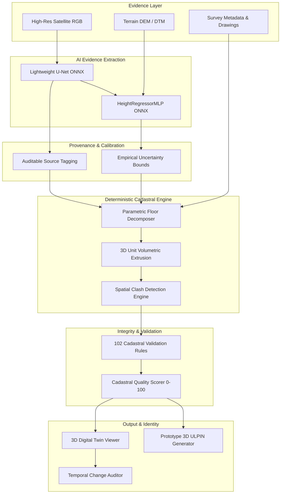

# 3D ULPIN & Vertical Property Mapping System

### AI-Assisted Evidence Extraction + Deterministic 3D Cadastral Construction

[](https://www.python.org/)
[](https://fastapi.tiangolo.com/)
[](https://react.dev/)
[](https://www.typescriptlang.org/)
[](https://onnxruntime.ai/)
[](https://threejs.org/)
[](tests/)

---

## 1. Overview

The **3D ULPIN & Vertical Property Mapping System** is a full-stack cadastral intelligence platform engineered for **Smart India Hackathon (SIH 26011)**.

The platform establishes an end-to-end bridge between real-world geospatial sensor observations (high-resolution satellite imagery, airborne LiDAR, digital elevation models, architectural floor plans) and modern digital cadastral management. It introduces a mathematically grounded vertical extension to India's 14-digit Unique Land Parcel Identification Number (**Bhu-Aadhaar / ULPIN**), enabling volumetric stratification, 3D property unit delineation, topological clash detection, digital twin visualization, and multi-epoch temporal change auditing.

---

## 2. SIH Problem Statement (SIH 26011)

### The Challenge
In modern high-density urban environments, land administration systems predominantly operate on 2D cadastral frameworks (parcels defined purely by horizontal latitude and longitude polygons). This 2D approach creates significant administrative, legal, and operational limitations:
- Multi-storey residential apartments, commercial offices, and utility networks share identical 2D ground footprints, obscuring vertical property ownership.
- Sub-surface infrastructure (basement parking, transit tunnels, underground utility vaults) cannot be cleanly recorded or audited against surface rights.
- Air rights, cantilevered structures, and vertical easements lack standardized digital identifiers.
- Physical resurveys struggle to detect unauthorized vertical expansions (e.g., added floors or altered unit boundaries) without manual on-site inspection.

### The Objective
To design and build an integrated system that:
1. Ingests geospatial sensor data to extract building footprints and vertical geometry.
2. Formulates a verifiable, collision-resistant **3D ULPIN** identifying properties in $(X, Y, Z)$ space.
3. Assembles a 3D Digital Twin with stratified volumetric units.
4. Executes deterministic rule-based cadastral validation.
5. Monitors temporal property changes across survey epochs.

---

## 3. What the System Does

The platform processes land parcels through a rigorous, auditable pipeline:

```
[Land Parcel Boundary & Multi-Source Evidence] (LiDAR LAS, Drone RGB, DEM/DTM, CAD DXF, Survey Deed)
        ↓
[CRS & Spatial Coverage Gating] (EPSG Verification, Spatial Intersection, Datum Validation)
        ↓
[AI Evidence Extraction & Calibration] (U-Net Footprint ONNX, Height Regressor ONNX, Derived Uncertainty ±m)
        ↓
[Multi-Source Evidence Fusion & Conflict Engine] (Statistical 2σ Tolerance Check, Discrepancy Adjudication)
        ↓
[Deterministic Cadastral Construction] (Building Shell, FloorLevel Strata, VerticalUnit Prisms)
        ↓
[102-Rule Validation Suite] (Geometry, Containment Hierarchy, Slab Continuity, 3D Clash Freedom)
        ↓
[Prototype 3D ULPIN Generation] (Geodetic SHA-256 + Strata Code + Luhn Mod-36 Dual Checksum)
        ↓
[Interactive 3D Digital Twin] (Three.js WebGL Volumetric Rendering & PostGIS Storage)
        ↓
[Temporal 3D Change Intelligence] (Multi-Epoch Geometric Delta & Surveyor Review Dispatch)
```

---

## 4. Core Architecture & Governance Principles

The system strictly enforces the boundary between **probabilistic AI evidence** and **authoritative cadastral truth**:

- **AI proposes, extracts, and estimates evidence**: Neural network models extract candidate footprints and advise on building heights with empirical uncertainty bounds ($\pm m$). AI is an evidence source, never unvetted legal fact.
- **Deterministic cadastral logic constructs cadastral geometry**: Cadastral building envelopes, vertical strata slices, and 3D property unit prisms are constructed purely through deterministic geometric algorithms and parametric municipal rules.
- **Deterministic validation checks geometry, topology, and data quality**: 102 rigid algorithmic validation rules enforce boundary validity, spatial hierarchy, vertical continuity, and 3D clash freedom.
- **Evidence conflicts require review and are never silently resolved**: Discrepancies between evidence sources exceeding statistical 2-sigma thresholds ($\Delta_{\text{tol}} = \max(2.5\text{m}, 2.0 \times \sqrt{u_1^2 + u_2^2})$) trigger mandatory `review_required = true` flags, preserving both measurements rather than silently averaging them.
- **Authoritative land records cannot be altered by raw AI inference alone.**



---

## 5. AI Models

The system incorporates two lightweight, trained neural models deployed via **ONNX Runtime (CPU)** with graceful deterministic fallbacks.

### 5.1 Building Footprint Segmentation (`BuildingDetector_LOD1`)
- **Architecture**: Lightweight Convolutional U-Net with Skip Connections
- **Runtime**: ONNX Runtime 1.20+ (CPU optimized)
- **Training Dataset**: SpaceNet 1 Rio de Janeiro (50 paired tiles, 2,180 verified building polygons, 0.5m GSD RGB)
- **Parameters**: 488,001 parameters (1.91 MB ONNX weights)
- **Verified Evaluation Metrics**:
  - Test IoU (Jaccard Index): **0.5001**
  - Dice / F1 Score: **0.6667**
  - Precision: **0.6193**
  - Recall: **0.7220**
  - Pixel Accuracy: **0.9318**
- **Inference Latency**: **17.86 ms** median (25.66 ms P95)
- **Deployment Artifact**: `models/building_detector.onnx` (`models/building_detector_metadata.json`)
- **Fallback**: Automatically falls back to observed parcel survey polygons (`PASS_THROUGH_OBSERVED`) if no imagery is supplied or weights are unavailable.

### 5.2 Building Height Regression (`HeightEstimator_Cascade`)
- **Architecture**: Multi-Layer Perceptron (`HeightRegressorMLP`) with Batch Normalization and ReLU
- **Runtime**: ONNX Runtime 1.20+ (CPU optimized)
- **Input Features**: 7 geometric and terrain attributes (footprint area, perimeter, bounding-box width/height, elongation, compactness, local terrain elevation)
- **Parameters**: 5,217 parameters (21.75 KB ONNX weights)
- **Verified Evaluation Metrics**:
  - Mean Absolute Error (MAE): **2.323 m**
  - Median Absolute Error (MedAE): **0.901 m**
  - Root Mean Squared Error (RMSE): **3.869 m**
  - 90th Percentile Error (P90 AE): **5.334 m**
  - Coefficient of Determination ($R^2$): **0.0357**
- **Inference Latency**: **38.38 ms** median (48.86 ms P95)
- **Deployment Artifact**: `models/height_estimator.onnx` (`models/height_estimator_metadata.json`)
### 5.3 Real LiDAR & Elevation Raster Preprocessing
- **LiDAR / LAS Point Cloud Engine** (`PointCloudPreprocessor`):
  - Ingests real ASPRS LAS/LAZ formats with georeferenced CRS headers (e.g., EPSG:32643 / UTM Zone 43N).
  - Isolates ASPRS Class 2 ground returns for bare-earth datum establishment ($Z_{\text{ground}}$).
  - Computes building surface elevation using robust 95th percentile ($Z_{95}$) to eliminate rooftop antennae, tree canopy, or sensor noise.
  - Computes empirical vertical uncertainty from point density: $u = \text{round}(0.30 + \frac{5.0}{\sqrt{\rho}}, 2)\text{ m}$.
  - **Strict Spatial Coverage Gating**: If LiDAR spatial bounds do not intersect the parcel footprint, evidence is categorized as `REJECTED_OUT_OF_BOUNDS` with zero height fabrication.
- **Raster Preprocessing Engine** (`RasterPreprocessor`):
  - Ingests GeoTIFF digital elevation models (USGS 3DEP, SRTM).
  - Classifies rasters into bare-earth DEM/DTM vs surface DSM. Bare-earth DEMs provide terrain elevations only and are never falsely converted into building heights without a surface model.

---

## 6. Multi-Source Evidence Fusion & Provenance Model

The **Multi-Source Evidence Fusion Engine** (`MultiSourceEvidenceFusionEngine`) ingests candidate measurements across 9 supported source sensor types, verifies coverage, audits discrepancies, and determines authoritative height:

### 6.1 Supported Source Sensor Options

| # | User-Facing Sensor Source | Field Label | Default Reference / Format | Evidence Class | Role & Priority |
|---|---|---|---|---|---|
| **1** | `DRONE_PHOTOGRAMMETRY` | Aerial Survey / Photogrammetry Dataset | `demo_26011_drone_survey.geojson` | `OBSERVED` | High-fidelity photogrammetric telemetry |
| **2** | `POINT_CLOUD` | Raw Point Cloud Telemetry (.las / .laz) | `sample_pointcloud.las` | `OBSERVED` | Real LiDAR returns (Bypasses AI) |
| **3** | `DSM_DTM` | Elevation Surface / Bare Earth Raster (.tif) | `usgs_3dep_dem_patch_512x512.tif` | `OBSERVED` | Bare-earth terrain elevation |
| **4** | `CAD_FLOOR_PLAN` | Architectural CAD Floor Plan (.dxf / .dwg) | `architectural_floor_plan_rev2.dxf` | `OBSERVED` | High-accuracy structural drawings |
| **5** | `BUILDING_METADATA` | Cadastral Deed / Registry Survey ID | `registered_cadastral_survey` | `OBSERVED` | Statutory building record declaration |
| **6** | `EXPLICIT_FLOOR_COUNT` | Storey Declaration / Cadastral Record | `surveyor_storey_declaration.record` | `DETERMINISTIC` | Official surveyor storey count declaration |
| **7** | `OBSERVED_HEIGHT_DECOMPOSITION` | Observed Total Station / Strata Telemetry | `total_station_height_telemetry.obs` | `OBSERVED` | Total station field observation |
| **8** | `AI_HEIGHT_DECOMPOSITION` | ONNX Neural Network Model Checkpoint | `models/height_estimator.onnx` | `AI_ESTIMATED` | Advisory neural network inference |
| **9** | `DETERMINISTIC_BASELINE` | Parametric Building Code / NBC Rule Set | `cadastral_parametric_rules` | `DETERMINISTIC` | Statutory municipal building code baseline |

### 6.2 Evidence Conflict Detection & Adjudication
- **Statistical 2-Sigma Combined Uncertainty**:
  $$\Delta_{\text{tol}} = \max\left(2.5\text{m},\; 2.0 \times \sqrt{u_1^2 + u_2^2}\right)$$
- When two valid evidence sources (e.g., 30.0m declared survey vs 18.21m observed LiDAR) disagree by more than $\Delta_{\text{tol}}$:
  - An `EvidenceConflictRecord` is logged with severity (`HIGH`, `MEDIUM`, `LOW`).
  - Mandatory `review_required = true` flag is raised.
  - Both raw values are preserved in the Digital Twin metadata; **measurements are never silently averaged or smoothed**.
- **AI Bypass Protocol**: Valid observed LiDAR point cloud or architectural evidence outranks AI inference, setting `ai_status = "BYPASSED_OBSERVED_EVIDENCE"` and `ai_model = "NOT_USED_OBSERVED_EVIDENCE"`.

### 6.3 Standardized Provenance Lineage Tags

Every property entity, geometry, and attribute records its full lineage via standardized provenance tags:

| Provenance Tag | Stage | Description |
|---|---|---|
| `AI_ONNX_INFERENCE` | Footprint | Extracted by U-Net ONNX model from satellite/aerial imagery |
| `PASS_THROUGH_OBSERVED` | Footprint | Ingested directly from registered cadastral boundary polygons |
| `POINT_CLOUD` | Height | Derived from verified ASPRS Class 2 LiDAR returns |
| `DEM_DTM` / `DSM_DTM` | Elevation | Ingested from bare-earth DEM or surface DSM raster |
| `EXPLICIT_SURVEY_METADATA` | Height | Ingested from registered deed or surveyor survey records |
| `CAD_FLOOR_PLAN` | Height | Ingested from architectural CAD drawings |
| `AI_REGRESSION` | Height | Inferred by `HeightRegressorMLP` neural network (Advisory) |
| `EXPLICIT_FLOOR_COUNT` | Strata | Directly parsed from verified surveyor storey declaration |
| `OBSERVED_HEIGHT_DECOMPOSITION` | Strata | Parametrically decomposed from LiDAR or total station telemetry |
| `AI_HEIGHT_DECOMPOSITION` | Strata | Decomposed from AI height regression (**flags surveyor review**) |
| `DETERMINISTIC_CASCADE` | Strata | Multiplied parametrically from floor count ($3.8\text{m} + (N-1) \times 3.0\text{m}$) |
| `DETERMINISTIC_BASELINE` | Strata | Standard single-storey default assumption (**flags surveyor review**) |
| `UNRESOLVED` | Any | Insufficient evidence to determine attribute |
| `TEST_FIXTURE_CHANGE` | Temporal | Controlled resurvey test fixture simulation |

---

## 7. Deterministic Cadastral Engine

The cadastral core models three-dimensional vertical rights through strict topological primitives:

- **Building**: Polyhedral structure bounded by footprint polygon, ground elevation ($Z_{\text{base}}$), and total height ($Z_{\text{roof}}$).
- **FloorLevel**: Vertical strata slice defined by ordinal index, floor code (e.g., `B01`, `L00`, `L01`), elevation range $[Z_{\text{min}}, Z_{\text{max}}]$, and standard ceiling/slab tolerances ($3.8\text{m}$ ground, $3.0\text{m}$ upper, $2.8\text{m}$ basement).
- **VerticalUnit**: 3D volumetric prism representing individual property rights (e.g., apartment, office suite, parking stall). Types supported:
  - `GROUND_LEVEL`: At-grade commercial or residential unit.
  - `ELEVATED`: Units situated above ground level.
  - `UNDERGROUND`: Sub-surface parking bays, basement storage, or infrastructure corridors.
  - `MULTI_LEVEL_INFRASTRUCTURE`: Duplex apartments or vertical utility shafts spanning multiple continuous floors.
- **3D Spatial Clash Engine**: Bounding-box pre-filtering followed by exact 3D polyhedral intersection testing prevents overlapping private units while allowing legal vertical stacking and common-area adjacency.

---

## 8. Cadastral Validation Engine

The platform incorporates **102 active validation rules** grouped across six critical dimensions:

1. **Geometry Validity**: Self-intersection checks (Shapely `is_valid`), closed boundary rings, non-zero area, and counter-clockwise exterior orientation.
2. **CRS & Projection**: EPSG verification, dynamic local UTM projection, and geodetic coordinate range bounds.
3. **Parcel Hierarchy**: Strict containment of buildings within parcel boundaries and vertical units within building envelopes.
4. **Strata Continuity**: Verification of vertical gaps, slab overlaps, and subterranean datum consistency.
5. **3D Spatial Clash Freedom**: Enforces pairwise intersection freedom ($\text{Volume}_{\text{clash}} = 0$) between private volumetric units.
6. **Attribute Completeness**: Validates required administrative fields, survey numbers, and ownership share sums ($= 100\%$).

> **Notice**: The Cadastral Validation Score (0–100, Grades A–D) is an **algorithmic technical data quality score**. It does not constitute a legal government title guarantee.

---

## 9. Prototype 3D ULPIN Specification

The system implements an engineering prototype extending India's 14-character Bhu-Aadhaar into 3D:

$$\text{3D ULPIN} = \underbrace{\text{BASE-14}}_{\text{2D Geodetic Hash}} - \underbrace{\text{L04}}_{\text{Level Code}} - \underbrace{\text{U402}}_{\text{Unit Code}} - \underbrace{\text{K9}}_{\text{Dual Luhn Mod-36 Checksum}}$$

1. **Base 14 Characters**: Formed from geodetic coordinate SHA-256 hash combined with state and survey identifiers, terminated by a Luhn mod-36 check character.
2. **Level Code**: Identifies vertical stratum (`L00` ground, `L03` 3rd floor, `B01` basement).
3. **Unit Code**: Identifies unit within floor (`U001`, `U302`, `UB01`).
4. **Dual Checksum**: Two-character verification code computed via cascaded Luhn mod-36 algorithm across all preceding characters. Catches single-character typos and character transpositions.

> **Legal Disclaimer**: *The 3D ULPIN implemented herein is an engineering prototype developed for the SIH 26011 competition. It is not claimed to be an official gazetted standard of the Government of India.*

---

## 10. 3D Digital Twin Viewer

The frontend provides an interactive WebGL Digital Twin powered by **Three.js** and **React**:
- **Volumetric Rendering**: Real-time rendering of parcel ground footprints, building envelopes, and stratified 3D unit prisms.
- **Layer & View Controls**: Toggle parcel boundaries, building shells, floor levels, underground units, air rights, and wireframe modes.
- **Subterranean Mode**: Lowers ground plane opacity to inspect underground parking and utility basements.
- **Property Inspector**: Displays volume ($\text{m}^3$), floor area ($\text{m}^2$), floor height, ownership records, and 3D ULPIN with one-click copy.
- **Lineage Panel**: Live drill-down into acquisition sensor, processing model, and spatial uncertainty.

---

## 11. Temporal 3D Change Intelligence

The temporal intelligence module enables multi-epoch cadastral comparison between a registered baseline digital twin and newly acquired surveys:
- **Footprint Delta**: Evaluates polygon intersection over union (IoU), detecting expansions or contractions.
- **Height Delta**: Detects unauthorized vertical floor additions or roof alterations ($\Delta h$).
- **Stratified Unit Comparison**: Tracks added, removed, or modified vertical units.
- **Technical Change Score**: Calibrated score ($0.00 - 1.00$) categorizing severity (`NONE`, `MINOR`, `MODERATE`, `SIGNIFICANT`, `CRITICAL`).
- **Surveyor Review Dispatch**: Automatically flags discrepancies for on-site inspection (`requires_surveyor_review = true`).

> **Advisory Notice**: *This report is a deterministic geometric change audit. It does not constitute legal ownership transfer, nor does it predict structural building failure. Official cadastral records remain unaltered until authorized surveyor review.*

---

## 12. Verified Performance Benchmarks

Measured on local test hardware across 10 iterations per operation:

| Pipeline Operation | Median Latency | P95 Latency | Response Payload |
|---|---|---|---|
| **ML Health Probe** | **2.10 ms** | 4.50 ms | 2,196 B |
| **Building Extraction (U-Net ONNX)** | **17.86 ms** | 25.66 ms | 646 B |
| **Height Estimation (MLP ONNX)** | **38.38 ms** | 48.86 ms | 817 B |
| **Floor Strata Decomposition** | **16.01 ms** | 18.98 ms | 1,390 B |
| **Vertical Unit Proposal** | **26.02 ms** | 28.16 ms | 4,348 B |
| **Parcel Processing Pipeline** | **124.73 ms** | 175.30 ms | 7,796 B |
| **Digital Twin Assembly** | **43.94 ms** | 61.00 ms | 9,272 B |
| **Temporal 3D Comparison** | **25.16 ms** | 48.97 ms | 2,093 B |

---

## 13. Testing & Verification

The prototype undergoes comprehensive automated verification across backend, ML, geospatial, and frontend components:

- **Backend Automated Tests**: **187 passed, 0 failed** in ~20s (`pytest -q`).
- **Adversarial Geospatial Suite**: **26 passed, 0 failed** (`pytest tests/test_adversarial_geospatial.py`). Tests boundary edge cases, multi-polygons, extreme coordinates, and degenerate geometries.
- **Frontend TypeScript Verification**: **0 errors** (`npx tsc --noEmit`).
- **Frontend Production Build**: **Clean build in 770ms** (`npm run build`).
- **Cadastral Flow Tests**: **12/12 passed** (`npx tsx src/lib/cadastralFlow.test.ts`). Validates complete lifecycle, UI transitions, and zero frontend mock fabrication.
- **Sensor Code Resolution**: **43/43 passed** (`npx tsx src/lib/sensorCodes.test.ts`). Audits mapping, fallbacks, and label resolution for all 11 internal sensor codes.
- **9-Source End-to-End Matrix**: **9/9 passed** (`python scripts/test_9_sensor_sources.py`). Tests every user-facing sensor source through live ingestion to digital twin provenance.
- **Phase 5 All-Scenario Suite**: **5/5 passed with zero fabrication** (`python scripts/verify_phase_5_all.py`):
  - *Scenario A*: Palakkad LiDAR (`DEMO-LIDAR-43N` → 18.21m, ±1.57m, AI bypassed)
  - *Scenario B*: Pune Out-of-Coverage (`DEMO-26011-001` → `REJECTED_OUT_OF_BOUNDS`, clean fallback, zero AI bleed)
  - *Scenario C*: AI Fallback (No physical sensors → ONNX height regression advisory estimate)
  - *Scenario D*: Evidence Conflict (30.0m survey vs 18.21m LiDAR → `HIGH` severity conflict logged, review required)
  - *Scenario E*: Dynamic Scaling (3 units / 3 floors → 24 units / 8 floors with distinct 3D ULPINs)

---

## 14. Project Structure

```
.
├── .env.example              # Environment configuration template
├── .gitignore                # Production ignore rules (excludes caches, weights, raw datasets)
├── README.md                 # System documentation & technical guide
├── walkthrough.md            # Verified audit logs, benchmarks, and demo evidence
├── pytest.ini                # Pytest execution configuration
├── requirements.txt          # Python dependency specifications
├── app/                      # FastAPI Backend Application
│   ├── api/v1/endpoints/     # REST controllers (parcels, jobs, units, ml, digital-twin)
│   ├── core/                 # Config, logging, exceptions, CRS projections
│   ├── db/                   # SQLAlchemy session management and base models
│   ├── jobs/                 # Multi-stage asynchronous job orchestrator and worker
│   ├── ml/                   # ML inference pipeline, ONNX wrappers, schemas
│   │   ├── features/         # Geometric feature extraction
│   │   ├── fusion/           # MultiSourceEvidenceFusionEngine & conflict detection
│   │   ├── models/           # BuildingDetector, HeightEstimator
│   │   ├── pipelines/        # FeatureExtractionPipeline orchestrator
│   │   └── preprocessing/    # PointCloudPreprocessor (LAS) & RasterPreprocessor (DEM)
│   ├── models/               # Database ORM entities (Parcel, Building, Unit, Floor)
│   ├── schemas/              # Pydantic v2 validation models
│   ├── services/             # CadastreService, SpatialEngine, DigitalTwinService
│   ├── temporal/             # Temporal change comparator and scoring
│   └── validation/           # 102 cadastral rules and quality scorer
├── data/                     # Geospatial Data Foundation
│   └── ml/                   # Dataset documentation, manifests, and test fixtures
├── docs/                     # Technical documentation & governance guides
│   ├── AI_MODEL_CARD.md      # Detailed architectures, training domains, metrics
│   ├── ARCHITECTURE.md       # Comprehensive system architecture & data flows
│   ├── DATASETS_AND_LICENSES.md # Geospatial data provenance & licensing
│   ├── DEMO_RUNBOOK.md       # Judge & evaluator execution guide
│   ├── EVIDENCE_AND_PROVENANCE.md # Multi-source fusion & sensor priority
│   └── LIMITATIONS.md        # Explicit scientific & legal boundaries
├── frontend/                 # React 19 + TypeScript + Three.js Application
│   ├── src/
│   │   ├── components/       # DigitalTwin, TemporalChange, Validation, Processing
│   │   ├── lib/              # API clients, sensorCodes, cadastral flow tests
│   │   ├── types/            # TypeScript interfaces mirroring backend schemas
│   │   ├── App.tsx           # Main application view
│   │   └── main.tsx          # Application entry point
│   ├── package.json          # Frontend dependencies and scripts
│   └── vite.config.ts        # Vite build configuration
├── models/                   # Deployed Trained Model Artifacts
│   ├── building_detector.onnx           # Trained U-Net segmentation model (1.91 MB)
│   ├── building_detector_metadata.json  # Checksums, parameters, metrics
│   ├── height_estimator.onnx            # Trained MLP height regressor (21.75 KB)
│   └── height_estimator_metadata.json   # Checksums, parameters, metrics
├── scripts/                  # Verification suites & demonstration scripts
│   ├── test_9_sensor_sources.py         # 9-source end-to-end test matrix
│   ├── verify_phase_5_all.py            # Phase 5 scenarios A–E verification
│   └── sih_final_demonstration.py       # Live judge evaluation walkthrough
└── tests/                    # 187 Pytest automated unit, integration, and API tests
```

---

## 15. Installation & Setup (Windows)

### Prerequisites
- Python 3.11, 3.12, or 3.13
- Node.js 18+ and npm
- Git

### 1. Clone the Repository
```powershell
git clone https://github.com/SreyasM24/3D-ULPIN-Vertical-Property-Mapping.git
cd 3D-ULPIN-Vertical-Property-Mapping
```

### 2. Backend Setup
```powershell
# Create and activate Python virtual environment
python -m venv venv
.\venv\Scripts\Activate.ps1

# Install dependencies
pip install -r requirements.txt

# Create environment configuration
copy .env.example .env

# Run automated tests to verify installation
pytest -v

# Start FastAPI backend server
uvicorn app.main:app --host 127.0.0.1 --port 8000 --reload
```
*FastAPI Swagger documentation will be available at: [http://127.0.0.1:8000/docs](http://127.0.0.1:8000/docs)*

### 3. Frontend Setup
```powershell
# Open a second terminal and navigate to frontend
cd frontend

# Install Node dependencies
npm install

# Verify TypeScript compilation
npx tsc --noEmit

# Start Vite development server
npm run dev -- --host 127.0.0.1 --port 5173
```
*Web application will be accessible at: [http://127.0.0.1:5173](http://127.0.0.1:5173)*

---

## 16. Environment Configuration

Copy `.env.example` to `.env`:

```ini
# Application Configuration
APP_NAME="3D ULPIN & Vertical Property Mapping System"
APP_ENV="development"
DEBUG=true
API_V1_STR="/api/v1"

# Server
HOST="127.0.0.1"
PORT=8000

# Database (Default: Local SQLite)
DATABASE_URL="sqlite:///./cadastre_3d.db"
DB_ECHO=false

# CORS Allowed Origins
CORS_ORIGINS=["http://localhost:3000","http://localhost:5173","http://127.0.0.1:3000","http://127.0.0.1:5173"]
```

---

## 17. Core API Endpoints

| Method | Endpoint | Description |
|---|---|---|
| `GET` | `/api/v1/health` | System health and database connectivity probe |
| `GET` | `/api/v1/ml/health` | ML subsystem health, ONNX session status |
| `GET` | `/api/v1/ml/capabilities` | Active ML models, architectures, parameter counts, and status |
| `GET` | `/api/v1/ml/models` | List active models, architectures, checksums, and metrics |
| `POST` | `/api/v1/ml/building/extract` | Extract building footprint from imagery tile (U-Net ONNX) |
| `POST` | `/api/v1/ml/building/height` | Infer building height from footprint and terrain (MLP ONNX) |
| `POST` | `/api/v1/ml/floors/decompose` | Decompose building height into parametric vertical strata |
| `POST` | `/api/v1/ml/vertical/propose` | Generate volumetric 3D unit prisms |
| `POST` | `/api/v1/jobs/process-parcel` | Orchestrate end-to-end parcel feature extraction job |
| `GET` | `/api/v1/jobs/{job_id}` | Poll asynchronous job status and progress timeline |
| `GET` | `/api/v1/parcels/{id}/digital-twin` | Retrieve 3D Digital Twin volumetric GeoJSON FeatureCollection |
| `GET` | `/api/v1/validation/parcels/{id}` | Execute 102 validation rules and compute quality score |
| `POST` | `/api/v1/digital-twin/compare` | Execute multi-epoch temporal 3D change comparison |

---

## 18. Demonstration Workflow

1. **Launch**: Start both backend (`uvicorn`) and frontend (`npm run dev`).
2. **Overview**: View registered parcel summary, active cadastral engine capabilities, and model readiness in the System Status dashboard.
3. **Survey Ingestion**: Navigate to Survey Processing, input parcel bounds or select a survey template, and trigger parcel processing.
4. **Digital Twin**: Open the 3D Digital Twin viewer to inspect the extruded building envelope and stratified vertical property units.
5. **Subterranean Inspection**: Toggle Subterranean Mode to visualize basement parking and underground infrastructure.
6. **3D ULPIN & Lineage**: Click any unit to inspect its prototype 3D ULPIN (e.g. `86A84BD932562C-L00-U001-XL`), sensor provenance, and spatial dimensions.
7. **Validation & Auditing**: Review the Cadastral Quality Report showing rule compliance across all 6 dimensions.
8. **Temporal Audit**: Run a temporal resurvey comparison to detect and review simulated vertical additions with advisory surveyor flags.

---

## 19. Datasets & Attribution

The project utilizes verified, open geospatial datasets documented in [`data/ml/README.md`](data/ml/README.md):
- **SpaceNet 1: Building Extraction (Rio de Janeiro)**: 0.5m GSD 3-band satellite imagery tiles paired with building polygon GeoJSON labels. Hosted on AWS Open Data under Creative Commons Attribution-ShareAlike 4.0 International.
- **3DBAG (TU Delft 3D Geoinformation Group)**: Open 3D building model dataset containing observed LoD 1.2 / 2.2 heights derived from AHN LiDAR. Released under CC-BY 4.0.
- **Microsoft Global ML Building Footprints**: Extracted building footprints covering Pune and Hyderabad. Released under the Open Data Commons Open Database License (ODbL).
- **USGS 3D Elevation Program (3DEP)**: 1-meter high-resolution digital elevation models (DEM) derived from airborne LiDAR. Public Domain (U.S. Government Work).

---

## 20. Technical Limitations & Non-Fabrication Governance

To maintain scientific integrity and legal accuracy, the system explicitly establishes its technical boundaries and governance model:

### 20.1 Core Governance Tenets
- **AI Proposes Evidence**: Machine learning models extract candidate building footprints and estimate heights with empirical uncertainty bounds ($\pm m$). AI output is strictly evidentiary input.
- **Deterministic Cadastral Construction**: Building polyhedra, floor strata, and vertical property unit prisms are constructed purely through deterministic geometric algorithms and statutory municipal parameters.
- **Deterministic Validation**: A suite of 102 rigid algorithmic rules enforces boundary validity, hierarchy containment, vertical continuity, and 3D spatial clash freedom.
- **Auditable Conflict Resolution**: Evidence conflicts between disparate data sources exceeding 2σ tolerance ($\Delta_{\text{tol}} = \max(2.5\text{m}, 2.0 \times \sqrt{u_1^2 + u_2^2})$) trigger mandatory `review_required = true` flags and are **never silently averaged or overwritten**.

### 20.2 Explicit Non-Claims
- **No Official Standard Claim**: The 3D ULPIN implemented herein is a competition engineering prototype. It is not an official gazetted standard of the Government of India or the Department of Land Resources (DoLR).
- **No Legal Title Guarantee**: The system produces technical data quality scores (0–100, Grades A–D) and cadastral geometry models. It does not grant, verify, or transfer legal property titles.
- **No Government Certification**: The prototype is an academic and engineering hackathon submission; it does not carry regulatory certification.
- **No Autonomous Adjudication**: The platform flags discrepancies and dispatches review notices for qualified human revenue surveyors. It does not autonomously adjudicate land disputes.
- **No Nationwide LiDAR Coverage**: Airborne LiDAR point cloud processing is supported where spatial coverage exists. The system does not claim nationwide LiDAR availability.
- **No Black-Box ML Floor Estimation**: Floor decomposition is deterministic and evidence-driven ($3.8\text{m}$ ground, $3.0\text{m}$ typical), not an opaque neural prediction.
- **AI is Not Authoritative Truth**: Neural network predictions serve strictly as advisory evidence when physical survey measurements are absent.

### 20.3 Specific Model & Dataset Limitations
- **Building Detector Domain**: The U-Net segmentation model was trained on SpaceNet 1 (Rio de Janeiro). Complex rural structures, dense organic settlements, or non-rectilinear indigenous architecture may exhibit lower intersection IoU.
- **Height Regressor Domain**: The MLP height regressor was trained on the 3DBAG Netherlands open building dataset. Its output carries an advisory uncertainty of $\pm 2.32\text{m}$ and reflects typical European urban morphology.
- **Spatial Gating**: LiDAR point clouds are strictly spatially gated. If target coordinates fall outside the LiDAR bounding box (e.g. Pune parcel evaluated against Palakkad point cloud), the evidence is categorized as `REJECTED_OUT_OF_BOUNDS`, preventing spurious height derivation.
- **DEM vs DSM Distinction**: Bare-earth digital elevation models (DEM/DTM) represent terrain elevation only ($Z_{\text{ground}}$) and are never falsely converted into building height without a true surface model (DSM).

---

## 21. Security & Data Protection

- **No Secrets Policy**: No private API keys, passwords, or cloud credentials are committed to version control.
- **Environment Isolation**: All configuration is managed via `.env` files using placeholder templates in `.env.example`.
- **Database Privacy**: SQLite/PostGIS databases are excluded from Git tracking via `.gitignore`. Ownership records support SHA-256 privacy-hashing for citizen identifiers.

---

## 22. License

This project is submitted for the **Smart India Hackathon (SIH 26011)**. All intellectual rights and distribution policies are subject to hackathon guidelines and the project author.

---

## 23. Acknowledgements

- **Smart India Hackathon (SIH 26011)** organizers and evaluators.
- **SpaceNet on AWS Open Data** for satellite imagery benchmarks.
- **TU Delft 3D Geoinformation Group** for 3DBAG elevation methodologies.
- The open-source communities behind **FastAPI**, **Three.js**, **ONNX Runtime**, **Shapely**, and **React**.

---

## 24. Author

**Sreyas Malla**  
B.Tech Computer Science & Engineering  
GITAM University
