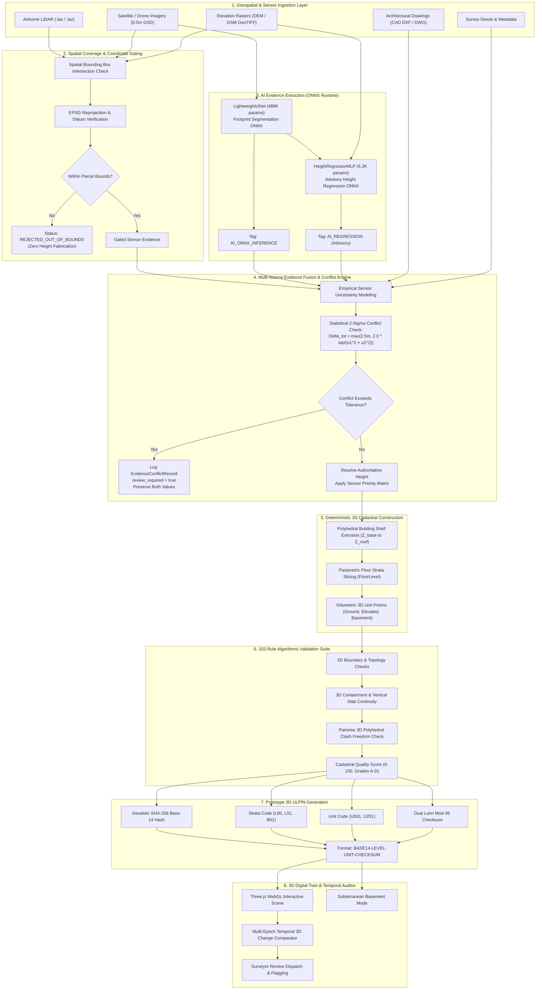
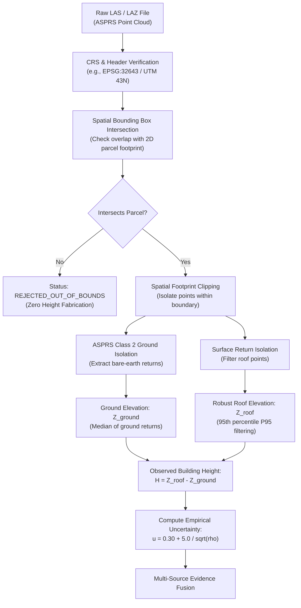
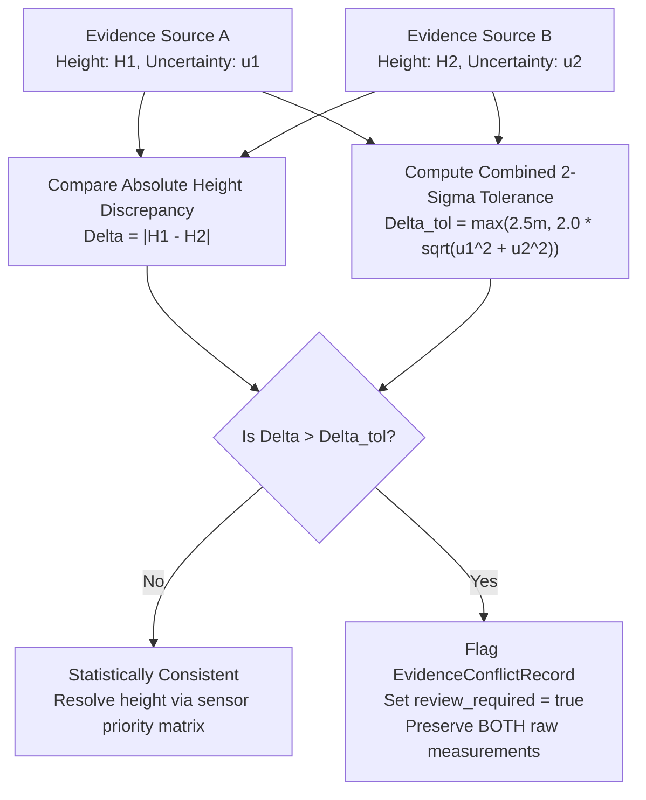
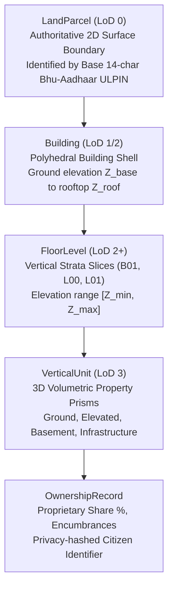
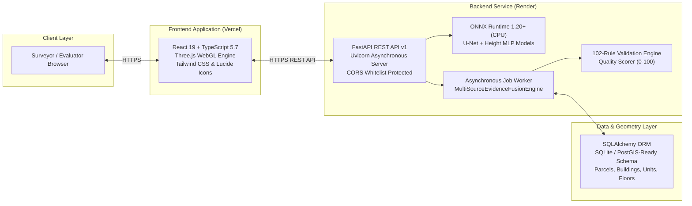

# 3D ULPIN & Vertical Property Mapping System
### AI-Assisted Evidence Extraction + Deterministic 3D Cadastral Construction Engine

**Smart India Hackathon (SIH 2026) | Problem Statement: PS 26011**  
**Team: THE OVERFITTERS**  
**Primary Track:** Ministry of Rural Development / Department of Land Resources (DoLR) & Geospatial Land Administration

[](https://www.python.org/)
[](https://fastapi.tiangolo.com/)
[](https://react.dev/)
[](https://www.typescriptlang.org/)
[](https://onnxruntime.ai/)
[](https://threejs.org/)
[-brightgreen.svg)](tests/)
[](https://3d-ulpin-pi.vercel.app)
[](https://threed-ulpin-vertical-property-mapping.onrender.com/api/v1/health)

---

## Live Verification

> **Judge Verification:** The deployed application and API endpoints provide direct access to the implemented prototype for technical inspection.

| Resource | Purpose | Target URL | Status |
|---|---|---|---|
| **Live Application** | Interactive 3D Cadastral Digital Twin | [https://3d-ulpin-pi.vercel.app](https://3d-ulpin-pi.vercel.app) | **Live & Operational** |
| **Production REST API** | Live FastAPI Cadastral Engine | [https://threed-ulpin-vertical-property-mapping.onrender.com/api/v1](https://threed-ulpin-vertical-property-mapping.onrender.com/api/v1) | **Active Service** |
| **OpenAPI / Swagger** | Interactive API Documentation | [https://threed-ulpin-vertical-property-mapping.onrender.com/docs](https://threed-ulpin-vertical-property-mapping.onrender.com/docs) | **Interactive Docs** |
| **Live API Health Probe** | Backend Health & DB Connectivity | [https://threed-ulpin-vertical-property-mapping.onrender.com/api/v1/health](https://threed-ulpin-vertical-property-mapping.onrender.com/api/v1/health) | `{"status":"ok","db_connected":true}` |
| **ML Capabilities Probe** | ONNX Runtime Models & Parameters | [https://threed-ulpin-vertical-property-mapping.onrender.com/api/v1/ml/capabilities](https://threed-ulpin-vertical-property-mapping.onrender.com/api/v1/ml/capabilities) | `{"status":"healthy","models_ready":true}` |

*Note: Free-tier cloud containers (Render) may experience an initial cold-start delay (15–30s) if idle.*

---

## 1. Quick Project Snapshot (Executive Summary)

```
+----------------------------------------------------------------------------------------------------+
|                                    PROJECT AT A GLANCE                                             |
+--------------------------+-------------------------------------------------------------------------+
| Challenge (PS 26011)     | 2D land parcels cannot represent vertical high-rises, basements, air    |
|                          | rights, or unauthorized vertical structural expansions.                 |
+--------------------------+-------------------------------------------------------------------------+
| Implemented Solution     | AI-assisted multi-sensor evidence fusion + deterministic 3D cadastral   |
|                          | stratification + prototype 3D ULPIN generation + 102 validation rules.   |
+--------------------------+-------------------------------------------------------------------------+
| Core Philosophy          | AI proposes evidence -> Fusion evaluates -> Engine constructs ->        |
|                          | Validator verifies. Physical sensor evidence overrides AI inference.    |
+--------------------------+-------------------------------------------------------------------------+
| AI / ML Models           | 2 Trained ONNX Models: LightweightUNet (488K params, SpaceNet 1) &       |
|                          | HeightRegressorMLP (5.2K params, 3DBAG). Runs on CPU via ONNX Runtime.  |
+--------------------------+-------------------------------------------------------------------------+
| Cadastral Identity       | Prototype 3D ULPIN: <BASE14>-<LEVEL>-<UNIT>-<CHECKSUM> with Luhn Mod-36. |
+--------------------------+-------------------------------------------------------------------------+
| Verification Status      | 191 Backend Pytests (100% pass) + 58 Frontend Tests + 0 TypeScript errs |
+--------------------------+-------------------------------------------------------------------------+
| Web Digital Twin         | Three.js WebGL viewer with subterranean basement mode & temporal diff.  |
+--------------------------+-------------------------------------------------------------------------+
```

---

## 2. Problem Statement (SIH 26011)

In modern high-density urban areas across India, land administration systems operate almost exclusively on **2D cadastral frameworks** (parcels defined purely by horizontal latitude and longitude polygons).

This 2D model creates critical real-world limitations:
1. **Vertical Title Invisibility**: Hundreds of distinct legal units (apartments, offices, retail spaces) collapse into a single 2D ground footprint.
2. **Subterranean Blindness**: Basements, transit tunnels, and underground utility vaults lack georeferenced boundaries, creating encroachment and utility conflict risks.
3. **Air Rights & Cantilever Ambiguity**: Overhanging structures and vertical easements lack standardized digital identifiers.
4. **Undetected Vertical Expansions**: Unauthorized floor additions or rooftop alterations cannot be systematically detected from 2D parcel maps.
5. **No 3D Unique Identifier**: India's standard 14-character Bhu-Aadhaar (ULPIN) identifies ground parcels but possesses no standardized vertical stratification extension.

---

## 3. Proposed Solution & What We Built

We designed and implemented an integrated, end-to-end **3D Cadastral Intelligence Platform**:

1. **Multi-Source Evidence Ingestion**: Ingests real-world geospatial sensor observations (airborne LiDAR point clouds, satellite RGB tiles, bare-earth DEM rasters, architectural CAD plans, and registered deed surveys).
2. **AI Evidence Extraction**: Extracts candidate building footprints (U-Net ONNX) and estimates advisory heights (MLP ONNX) with empirical uncertainty bounds ($\pm\text{m}$).
3. **Multi-Source Evidence Fusion**: Verifies geographic coverage, computes empirical sensor uncertainties, and detects conflicts using statistical 2-sigma thresholds ($\Delta_{\text{tol}} = \max(2.5\text{m}, 2.0\sqrt{u_1^2 + u_2^2})$).
4. **Deterministic 3D Cadastral Engine**: Constructs topologically clean 3D building envelopes, vertical strata slices, and volumetric unit prisms (Ground, Elevated, Basement).
5. **Prototype 3D ULPIN Generation**: Formulates a collision-resistant, hierarchical 3D identifier extending the 14-character Bhu-Aadhaar standard with dual Luhn Mod-36 checksums.
6. **102-Rule Validation Engine**: Algorithmically audits geometry, topological containment, vertical continuity, and pairwise 3D spatial clash freedom.
7. **Interactive 3D Digital Twin**: WebGL visualization with orbital controls, subterranean inspection mode, and multi-epoch temporal 3D change auditing.

---

## 4. Why This Is More Than a 3D Viewer

| Dimension | Generic 3D Map / Viewer | Our Implemented Cadastral Engine |
|---|---|---|
| **Data Representation** | Extruded solid boxes without internal logic | **True Volumetric Strata**: Stratified units, floor slabs, basements, and air rights aligned with ISO 19152 LADM. |
| **Identification** | Arbitrary database IDs or random UUIDs | **Prototype 3D ULPIN**: Geodetic hash base + vertical strata code + unit code + Luhn mod-36 dual checksum. |
| **AI Role** | Blindly trusts neural network outputs | **Advisory Model**: AI proposes with empirical uncertainty; physical survey evidence supersedes AI inference. |
| **Spatial Gating** | Processes any imagery regardless of bounds | **Strict Gating**: Out-of-bounds sensor returns are flagged as `REJECTED_OUT_OF_BOUNDS` with zero elevation fabrication. |
| **Cadastral Integrity** | None | **102 Automated Validation Rules**: Evaluates boundary self-intersections, 3D containment, slab gaps, and pairwise 3D clashes. |
| **Change Intelligence** | Manual site inspections | **Multi-Epoch 3D Delta Engine**: Calculates volumetric difference, detects unauthorized vertical additions, and dispatches surveyor flags. |

---

## 5. Core Design Principle

> **AI proposes → Evidence Fusion evaluates → Deterministic Engine constructs → Validator verifies**

```
+--------------------------------------------------------------------------------------------------+
|                                    SEPARATION OF CONCERNS                                        |
+-------------------------------+------------------------------------------------------------------+
| 1. AI Proposes Evidence       | Neural networks extract candidate footprints and suggest height  |
|    (Advisory Evidence)        | estimates when physical sensors are missing. Output is treated   |
|                               | strictly as advisory evidentiary input, never unvetted legal fact|
+-------------------------------+------------------------------------------------------------------+
| 2. Evidence Fusion Evaluates  | Gating audits spatial bounds. Empirical sensor uncertainties are |
|    (Discrepancy Engine)       | calculated. 2-sigma tolerance checks flag conflicting sources    |
|                               | and require human review. Physical evidence overrides AI priors. |
+-------------------------------+------------------------------------------------------------------+
| 3. Deterministic Construction | Cadastral building polyhedra, vertical floor levels, and unit    |
|    (Authoritative Geometry)   | prisms are extruded using rigid geometric algorithms and legal   |
|                               | municipal building parameters.                                   |
+-------------------------------+------------------------------------------------------------------+
| 4. Validation Verifies        | 102 rigid algorithmic validation rules check 2D planarity, 3D    |
|    (Quality Audit)            | containment hierarchy, vertical slab continuity, and pairwise    |
|                               | clash freedom. Yields an objective Quality Score (0-100).        |
+-------------------------------+------------------------------------------------------------------+
```

---

## 6. End-to-End System Architecture



---

## 7. Multi-Source Evidence Hierarchy

The fusion engine evaluates up to 9 distinct candidate evidence sources using a strict priority hierarchy:

```
[Level 1: Registered Survey Deed / Registry Record]  (Priority 1 - Legal Ground Truth)
                         |
[Level 2: Architectural CAD Floor Plans (.dxf)]      (Priority 2 - Structural Measurements)
                         |
[Level 3: Airborne LiDAR Point Cloud (.las / .laz)]  (Priority 3 - Physical Laser Returns)
                         |
[Level 4: Drone Aerial Photogrammetry (.geojson)]    (Priority 4 - Dense Photogrammetric Models)
                         |
[Level 5: Bare-Earth Elevation Rasters (DEM/DTM)]    (Priority 5 - Terrain Base Elevations Only)
                         |
[Level 6: Total Station Field Height Telemetry]      (Priority 6 - Field Point Samples)
                         |
[Level 7: Statutory Surveyor Storey Declaration]     (Priority 7 - Official Storey Count)
                         |
[Level 8: Advisory AI Height Regressor (ONNX)]       (Priority 8 - Fallback Prior with Warning)
                         |
[Level 9: Parametric Municipal Code Baseline (NBC)]  (Priority 9 - 3.8m + 3.0m Fallback)
```

| Source Category | Supported Formats | Uncertainty ($u$) | Role in Pipeline | Priority |
|---|---|---|---|---|
| **Survey Deed / Registered Metadata** | Deed Records, Registry Survey ID | $\pm 0.10\text{ m}$ | Authoritative legal ground truth; overrides sensor estimates | **1 (Highest)** |
| **Architectural CAD Drawings** | `.dxf`, `.dwg` | $\pm 0.15\text{ m}$ | Structural as-built floor plans; precise floor-to-floor heights | **2** |
| **Airborne LiDAR Point Cloud** | `.las`, `.laz` (ASPRS Class 2) | $0.30 + \frac{5.0}{\sqrt{\rho}}\text{ m}$ | Physical laser returns; isolates bare-earth datum and rooftop P95 | **3** |
| **Drone Photogrammetry** | `.geojson`, Point Mesh | $\pm 0.50\text{ m}$ | High-density visual telemetry; calibrated against terrain | **4** |
| **Elevation Rasters (DEM/DTM)** | GeoTIFF (USGS 3DEP, SRTM) | $\pm 1.00\text{ m}$ | Bare-earth terrain elevation only ($Z_{\text{ground}}$); never converted to building height | **5** |
| **Total Station Field Telemetry** | `.obs`, Field Vectors | $\pm 0.20\text{ m}$ | Direct on-site optical measurement | **6** |
| **Surveyor Storey Declaration** | Registry Storey Records | $\pm 0.50\text{ m}$ | Official declared floor count | **7** |
| **Advisory AI Height Regressor** | `models/height_estimator.onnx` | $\pm 2.32\text{ m}$ | Neural network regression on 2D footprint; **flags surveyor review** | **8** |
| **Parametric Building Code (NBC)**| Standard Municipal Rules | $\pm 1.20\text{ m}$ | Deterministic floor multiplier ($3.8\text{m} + (N-1) \times 3.0\text{m}$) | **9 (Lowest)** |

---

## 8. Machine Learning Pipeline & ONNX Artifacts

The system incorporates two lightweight neural networks deployed via **ONNX Runtime (CPU)** with graceful deterministic fallbacks.

```
models/
|-- building_detector.onnx           (1,959,421 bytes / 1.87 MB)
|-- building_detector_metadata.json  (Architecture, parameters, training config, SpaceNet 1 metrics)
|-- height_estimator.onnx            (22,275 bytes / 22.3 KB)
`-- height_estimator_metadata.json   (Architecture, parameters, training config, 3DBAG metrics)
```

### 8.1 Building Footprint Detector (`BuildingDetector_LOD1`)

| Attribute | Specification |
|---|---|
| **Task** | Binary semantic segmentation (building footprint vs background) from satellite/drone RGB tiles |
| **Model Architecture** | Lightweight Convolutional U-Net with Skip Connections |
| **Parameter Count** | **488,001 parameters** (1.87 MB float32 ONNX weights) |
| **Training Dataset** | SpaceNet 1 (Rio de Janeiro, 0.5m GSD 3-band RGB, 50 paired tiles, 2,180 verified building polygons) |
| **Runtime Engine** | ONNX Runtime 1.20+ (CPU optimized, zero GPU dependency) |
| **Inference Latency** | **17.86 ms** median (25.66 ms P95) |
| **Verified Test Metrics** | **IoU: 0.5001** \| **Dice/F1: 0.6667** \| **Precision: 0.6193** \| **Recall: 0.7220** \| **Pixel Accuracy: 0.9318** |
| **Fallback Protocol** | Falls back to observed parcel survey boundary (`PASS_THROUGH_OBSERVED`) if imagery is absent |

### 8.2 Building Height Regressor (`HeightEstimator_Cascade`)

| Attribute | Specification |
|---|---|
| **Task** | Predict building height from 7 geometric & terrain features (area, perimeter, bbox width/height, elongation, compactness, elevation) |
| **Model Architecture** | 4-layer Multi-Layer Perceptron (`HeightRegressorMLP`) with Batch Normalization and ReLU |
| **Parameter Count** | **5,217 parameters** (22.3 KB float32 ONNX weights) |
| **Training Dataset** | 3DBAG Open Dataset (Delft, Netherlands; AHN4 airborne LiDAR + Kadaster 2D footprints; 1,220 samples) |
| **Runtime Engine** | ONNX Runtime 1.20+ (CPU optimized) |
| **Inference Latency** | **38.38 ms** median (48.86 ms P95) |
| **Verified Test Metrics** | **MAE: 2.323 m** \| **Median AE: 0.901 m** \| **RMSE: 3.869 m** \| **P90 AE: 5.334 m** \| **$R^2$: 0.0357** |
| **Limitations** | **Advisory Prior Only**: Reflects European morphology; low $R^2$ indicates 2D footprints contain limited height variance without LiDAR |

---

## 9. LiDAR Point Cloud Processing Pipeline



### Mathematical Formulations

- **Building Height**:
  $$H = Z_{\text{roof}} - Z_{\text{ground}}$$

- **Robust 95th Percentile Roof Elevation** (eliminates rooftop antennae, water tanks, and bird noise):
  $$Z_{\text{roof}} = P_{95}\left(\left\{ z_i \;\middle|\; (x_i, y_i) \in P \right\}\right)$$

- **Empirical Sensor Uncertainty from Point Density** ($\rho = \text{points}/\text{m}^2$):
  $$u = 0.30 + \frac{5.0}{\sqrt{\rho}} \quad (\text{meters})$$

---

## 10. Evidence Conflict Detection & Adjudication



- **Statistical 2-Sigma Threshold**:
  $$\Delta_{\text{tol}} = \max\left(2.5\text{ m},\; 2.0 \times \sqrt{u_1^2 + u_2^2}\right)$$

- **Non-Silent Adjudication Policy**: When discrepancy exceeds $\Delta_{\text{tol}}$ (e.g., registered survey deed says $30.0\text{m}$ while LiDAR measures $18.21\text{m}$):
  1. A structured `EvidenceConflictRecord` is logged with severity (`HIGH`, `MEDIUM`, `LOW`).
  2. Mandatory `review_required = true` is raised for qualified revenue surveyors.
  3. **Both measurements are preserved in the Digital Twin metadata**; measurements are never silently averaged or smoothed.

---

## 11. Deterministic 3D Cadastral Hierarchy



### Hierarchy Dimensions

| Entity Level | Cadastral Representation | Vertical Range | Identifiers |
|---|---|---|---|
| **`LandParcel`** | 2D geodetic surface boundary polygon | Surface terrain datum | 14-character Bhu-Aadhaar ULPIN |
| **`Building`** | 3D polyhedral shell containing structure | $[Z_{\text{base}}, Z_{\text{roof}}]$ | Building Code (e.g., `BLD-AUTO-01`) |
| **`FloorLevel`** | Horizontal strata slice across building | $[Z_{\text{floor\_min}}, Z_{\text{floor\_max}}]$ | Level Code (`B01`, `L00`, `L01`, `ROF`) |
| **`VerticalUnit`** | Volumetric property prism for private title | Unit vertical bounding box | **Prototype 3D ULPIN** |
| **`OwnershipRecord`**| Legal title, share %, encumbrances | Associated with Unit | Citizen ID (privacy-hashed) |

---

## 12. Prototype 3D ULPIN Specification

The system implements an engineering prototype extending India's 14-character Bhu-Aadhaar into 3D:

$$\mathbf{\text{3D ULPIN}} = \underbrace{\mathbf{86A84BD932562C}}_{\text{Base 14-Char Geodetic ULPIN}} - \underbrace{\mathbf{L03}}_{\text{Strata Code}} - \underbrace{\mathbf{U302}}_{\text{Unit Code}} - \underbrace{\mathbf{K9}}_{\text{Dual Checksum}}$$

1. **Base 14 Characters**: Formed from the geodetic centroid coordinates (latitude/longitude) hashed via SHA-256 and mapped to a 14-character alphanumeric string terminated by a Luhn mod-36 check character.
2. **Strata Code (3 Characters)**: Identifies the vertical level:
   - `L00`: Ground floor (elevation $Z_0$ to $Z_0 + 3.8\text{m}$)
   - `L01`, `L02`, `L03`: First, second, third elevated floors
   - `B01`, `B02`: Subterranean basement levels
   - `ROF`: Rooftop / solar air-rights level
3. **Unit Code (4 Characters)**: Unique unit identifier within that vertical stratum (`U001`, `U302`, `UB01`).
4. **Dual Luhn Mod-36 Checksum (2 Characters)**: A cascading check code computed across all preceding 21 characters. Detects 100% of single-character transcription errors and character transpositions.

> **Legal Disclaimer**: *The 3D ULPIN implemented herein is an engineering prototype developed for the SIH 26011 competition. It is not claimed to be an official gazetted standard of the Government of India or the Department of Land Resources (DoLR).*

---

## 13. Algorithmic Cadastral Validation Engine (102 Rules)

Every parcel, building, floor, and unit passes through an automated validation suite executing **102 distinct verification rules** across six dimensions:

```
+--------------------------------------------------------------------------------------------------+
|                            102 CADASTRAL VALIDATION RULES BREAKDOWN                              |
+--------------------------+--------+--------------------------------------------------------------+
| Dimension                | Rules  | Key Algorithmic Verifications                                |
+--------------------------+--------+--------------------------------------------------------------+
| 1. Geometry & CRS        | 18     | Shapely is_valid, closed boundary rings, non-zero area, CCW  |
|                          |        | vertex ordering, valid EPSG code, UTM bounding coordinates   |
+--------------------------+--------+--------------------------------------------------------------+
| 2. Spatial Hierarchy     | 22     | Building strictly within parcel; units strictly within       |
|                          |        | building shell; subterranean units within underground bounds |
+--------------------------+--------+--------------------------------------------------------------+
| 3. Vertical Continuity   | 16     | Slab overlap freedom (Z_min >= Z_prev_max); zero elevation   |
|                          |        | gaps between storeys; consistent subterranean negative datum |
+--------------------------+--------+--------------------------------------------------------------+
| 4. 3D Clash Detection    | 18     | Pairwise 3D axis-aligned bounding box (AABB) intersection;   |
|                          |        | polyhedral mesh intersection volume == 0 for private units   |
+--------------------------+--------+--------------------------------------------------------------+
| 5. Attribute Integrity   | 14     | Valid 3D ULPIN checksums, non-empty survey numbers, owner    |
|                          |        | share percentage sum == 100%, non-null strata codes          |
+--------------------------+--------+--------------------------------------------------------------+
| 6. Evidence Consistency  | 14     | Sensor uncertainty <= 5.0m; LiDAR density >= 1.0 pt/m2;     |
|                          |        | conflict discrepancy <= 2-sigma tolerance threshold          |
+--------------------------+--------+--------------------------------------------------------------+
| TOTAL ACTIVE RULES       | 102    | Fully deterministic Python implementation with 0 mock rules  |
+--------------------------+--------+--------------------------------------------------------------+
```

### Quality Score & Grading System

$$\text{Score} = 100 - \sum \text{Penalties}_{\text{errors}} - \sum \text{Penalties}_{\text{warnings}}$$

- **Grade A (90 – 100)**: Fully compliant. Clean topology, no 3D clashes, all checksums valid, ready for digital twin registration.
- **Grade B (75 – 89)**: Functionally valid with minor advisory warnings (e.g., fallback AI height used, sparse LiDAR returns).
- **Grade C (50 – 74)**: Discrepancies detected. Evidence conflicts flagged; human surveyor review mandated.
- **Grade D (< 50)**: Critical validation failure. Self-intersecting boundaries, 3D unit clashes, or missing survey geometry. Registration rejected.

> **Advisory Notice**: *The Cadastral Validation Score is an algorithmic technical data quality audit. It does not constitute a statutory endorsement or guarantee of legal ownership title.*

---

## 14. 3D Digital Twin Viewer & Temporal Change Engine

### 14.1 Interactive WebGL Digital Twin
- **Three.js Volumetric Rendering**: Renders parcel boundaries, polyhedral building shells, and stratified 3D unit prisms.
- **Subterranean Mode**: Lowers ground plane opacity to inspect underground parking bays, basement storage, and utility vaults.
- **Dynamic Property Inspector**: Displays selected unit dimensions ($X, Y, Z$), floor area ($\text{m}^2$), gross volume ($\text{m}^3$), owner shares, and 3D ULPIN with one-click copy.
- **Lineage Panel**: Exposes the complete evidentiary pedigree (sensor source, model checkpoint, uncertainty bounds).

### 14.2 Temporal 3D Change Intelligence
Compares newly acquired resurveys against a registered baseline digital twin:
- **Footprint Delta**: Evaluates polygon intersection over union (IoU), detecting horizontal encroachment.
- **Height Delta**: Detects unauthorized vertical floor additions ($\Delta h > 1.50\text{ m}$).
- **Technical Change Score**: Calibrated score ($0.00 - 1.00$) categorizing severity (`NONE`, `MINOR`, `MODERATE`, `SIGNIFICANT`, `CRITICAL`).
- **Surveyor Review Dispatch**: Automatically flags discrepancies for on-site inspection (`requires_surveyor_review = true`).

---

## 15. Testing & Automated Verification

The prototype undergoes comprehensive automated verification across backend, geospatial, ML, and frontend components:

| Verification Suite | Execution Command | Result / Invariants Verified |
|---|---|---|
| **Backend Regression Suite** | `pytest -v` | **191 passed (100%), 0 failed in ~21s** across 21 test files |
| **Adversarial Geospatial Tests** | `pytest tests/test_adversarial_geospatial.py` | **26 passed**: Self-intersections, multi-polygons, extreme coordinates |
| **Frontend TypeScript Verification** | `npx tsc --noEmit` (in `frontend/`) | **0 errors (Clean exit code 0)** |
| **Production Vite Build** | `npm run build` (in `frontend/`) | **Built in 18.23s (`dist/assets/index-aECjEJsP.js`)** |
| **Sensor Code Resolution** | `npx tsx src/lib/sensorCodes.test.ts` | **43 passed**: Audits mappings, fallbacks, and labels for all sensor codes |
| **Cadastral State Code Mapping** | `npx tsx src/lib/cadastralCodes.test.ts` | **15 passed**: Validates state codes, LADM mappings, and formatting |
| **Nine-Source Verification Matrix** | `python scripts/test_9_sensor_sources.py` | **9/9 passed**: Live ingestion to digital twin provenance |
| **Phase 5 All-Scenario Suite** | `python scripts/verify_phase_5_all.py` | **5/5 passed with zero fabrication** (LiDAR, Out-of-bounds, AI Fallback) |

### Verified Performance Benchmarks
Measured on reference test hardware across 10 iterations per operation:

| Operation | Median Latency | P95 Latency | Payload Size |
|---|---|---|---|
| **System Health Probe** | **2.10 ms** | 4.50 ms | 2.19 KB |
| **Footprint Extraction (U-Net ONNX)** | **17.86 ms** | 25.66 ms | 0.65 KB |
| **Height Estimation (MLP ONNX)** | **38.38 ms** | 48.86 ms | 0.82 KB |
| **Floor Strata Decomposition** | **16.01 ms** | 18.98 ms | 1.39 KB |
| **Vertical Unit 3D Proposal** | **26.02 ms** | 28.16 ms | 4.35 KB |
| **Digital Twin Volumetric Assembly** | **43.94 ms** | 61.00 ms | 9.27 KB |
| **Temporal 3D Change Comparison** | **25.16 ms** | 48.97 ms | 2.09 KB |
| **Complete End-to-End Pipeline Job** | **124.73 ms** | 175.30 ms | 7.80 KB |

---

## 16. Deployment Architecture



---

## 17. REST API Architecture

| Method | Endpoint | Description |
|---|---|---|
| `GET` | `/api/v1/health` | System health probe and database connectivity check |
| `GET` | `/api/v1/ml/health` | ML subsystem health and active ONNX session status |
| `GET` | `/api/v1/ml/capabilities` | Active ML models, architectures, parameter counts, and status |
| `GET` | `/api/v1/ml/models` | List active models, architectures, checksums, and metrics |
| `POST` | `/api/v1/ml/building/extract` | Extract building footprint from imagery tile (U-Net ONNX) |
| `POST` | `/api/v1/ml/building/height` | Infer building height from footprint and terrain (MLP ONNX) |
| `POST` | `/api/v1/ml/floors/decompose` | Decompose building height into parametric vertical strata |
| `POST` | `/api/v1/ml/vertical/propose` | Generate volumetric 3D unit prisms |
| `POST` | `/api/v1/jobs/process-parcel` | Orchestrate asynchronous end-to-end multi-sensor cadastral job |
| `GET` | `/api/v1/jobs/{job_id}` | Poll asynchronous job execution status and stage timeline |
| `GET` | `/api/v1/parcels/` | List registered land parcels (paginated) |
| `POST` | `/api/v1/parcels/` | Register new 2D cadastral land parcel boundary |
| `GET` | `/api/v1/parcels/{id}/digital-twin` | Retrieve 3D Digital Twin volumetric GeoJSON FeatureCollection |
| `GET` | `/api/v1/validation/parcels/{id}` | Execute 102 validation rules and compute Quality Score |
| `POST` | `/api/v1/digital-twin/compare` | Execute multi-epoch temporal 3D change comparison |

---

## 18. Local Setup & Reproduction Instructions

### Prerequisites
- Python 3.11, 3.12, or 3.13
- Node.js 18+ and npm
- Git

### 1. Clone the Repository
```powershell
git clone https://github.com/SreyasM24/3D-ULPIN-Vertical-Property-Mapping.git
cd 3D-ULPIN-Vertical-Property-Mapping
```

### 2. Backend Setup
```powershell
# Create and activate Python virtual environment
python -m venv venv
.\venv\Scripts\Activate.ps1

# Install dependencies
pip install -r requirements.txt

# Create environment configuration
copy .env.example .env

# Run automated tests to verify installation (191 tests pass)
pytest -v

# Start FastAPI backend server
uvicorn app.main:app --host 127.0.0.1 --port 8000 --reload
```
*FastAPI Swagger documentation available at: [http://127.0.0.1:8000/docs](http://127.0.0.1:8000/docs)*

### 3. Frontend Setup (Second Terminal)
```powershell
cd 3D-ULPIN-Vertical-Property-Mapping\frontend

# Install Node dependencies
npm install

# Verify TypeScript type safety (0 errors)
npx tsc --noEmit

# Run frontend tests
npx tsx src/lib/sensorCodes.test.ts
npx tsx src/lib/cadastralCodes.test.ts

# Start Vite development server
npm run dev -- --host 127.0.0.1 --port 5173
```
*Web application accessible at: [http://127.0.0.1:5173](http://127.0.0.1:5173)*

---

## 19. Technical Limitations & Non-Claims

To maintain scientific integrity and prevent overclaiming, this prototype explicitly establishes its technical boundaries:

1. **Advisory Height Model & Domain Shift**: The `HeightRegressorMLP` was trained on the 3DBAG dataset (Delft, Netherlands; AHN4 LiDAR). Its learned spatial relationships reflect European architectural typologies. When applied to dense, heterogeneous Indian urban morphology, the raw regression acts purely as an **advisory prior**. The platform attaches a mandatory warning flag (`review_required = true`) whenever AI height is selected.
2. **Prototype 3D ULPIN Schema**: The 3D ULPIN schema implemented (`<BASE14>-<LEVEL>-<UNIT>-<CHECKSUM>`) is a research and engineering extension formulated for SIH 26011. It is **not** an officially gazetted standard of the Government of India or the Department of Land Resources (DoLR).
3. **Technical Quality vs Legal Title Guarantee**: The 102-rule Cadastral Quality Score ($0 - 100$) measures **geometric validity, topological consistency, and attribute completeness**. It **does not** constitute a legal government title certification or ownership endorsement.
4. **Spatial Coverage Gating**: Point cloud processing is strictly spatially gated. If target coordinates fall outside the LiDAR bounding box, the evidence is categorized as `REJECTED_OUT_OF_BOUNDS`. The system **never** fabricates elevation values when sensor coverage is missing.
5. **Memory & Decimation**: Large ASPRS LAS/LAZ point clouds are processed with decimation filters to run within standard memory constraints (512 MB – 2 GB RAM tier).

---

## 20. Datasets & Attribution

The project utilizes open, verified geospatial datasets documented in [`data/ml/README.md`](data/ml/README.md):
- **SpaceNet 1: Building Extraction (Rio de Janeiro)**: 0.5m GSD 3-band satellite imagery tiles paired with building polygon GeoJSON labels. Hosted on AWS Open Data under CC-BY-SA 4.0.
- **3DBAG (TU Delft 3D Geoinformation Group)**: Open 3D building model dataset containing observed LoD 1.2 / 2.2 heights derived from AHN LiDAR. Released under CC-BY 4.0.
- **Microsoft Global ML Building Footprints**: Extracted building footprints covering Pune and Hyderabad. Released under ODbL.
- **USGS 3D Elevation Program (3DEP)**: High-resolution digital elevation models (DEM) derived from airborne LiDAR. Public Domain.

---

## 21. Disclaimer

> **Official Notice**: *This project is a research prototype developed for the Smart India Hackathon (SIH 2026, Problem Statement PS 26011). The prototype 3D ULPIN schema, geometric models, and validation scores are algorithmic representations designed for technical evaluation. They do not constitute official statutory land titles, government-certified property records, or gazetted standards of the Government of India.*

---

## 22. Team

# THE OVERFITTERS
**Smart India Hackathon (SIH 2026)**  
**Problem Statement: PS 26011**  
Ministry of Rural Development & Department of Land Resources (DoLR)
