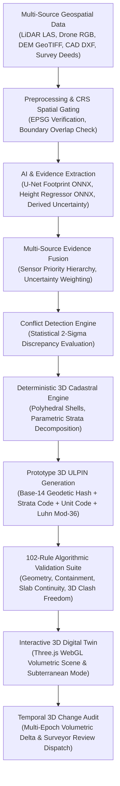
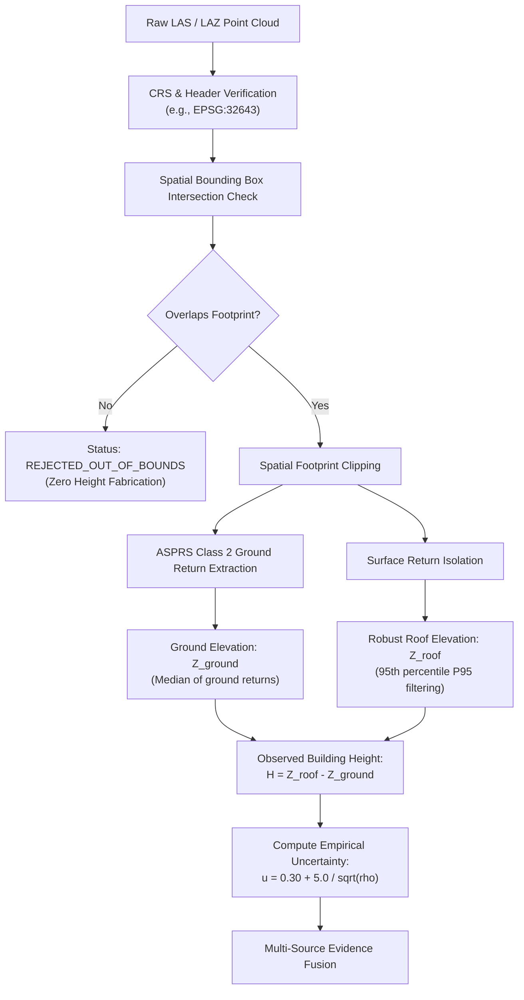
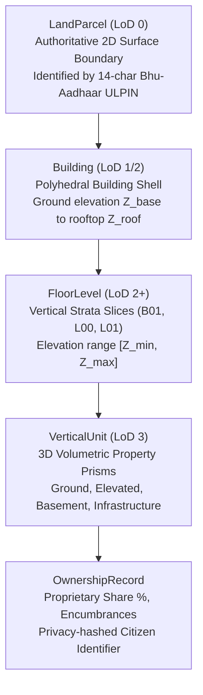
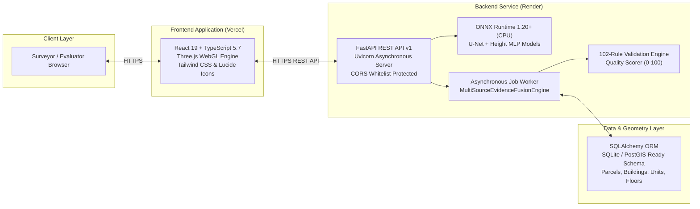

# 3D ULPIN & Vertical Property Mapping System

**THE OVERFITTERS — Smart India Hackathon (SIH 2026)**  
**Problem Statement: PS 26011**  
**Primary Track:** Ministry of Rural Development / Department of Land Resources (DoLR) & Geospatial Land Administration

[](https://www.python.org/)
[](https://fastapi.tiangolo.com/)
[](https://react.dev/)
[](https://www.typescriptlang.org/)
[](https://onnxruntime.ai/)
[](https://threejs.org/)
[-brightgreen.svg)](tests/)
[](https://3d-ulpin-pi.vercel.app)
[](https://threed-ulpin-vertical-property-mapping.onrender.com/api/v1/health)

The **3D ULPIN & Vertical Property Mapping System** is an end-to-end cadastral intelligence platform engineered for **Smart India Hackathon (SIH 2026, PS 26011)**. The platform bridges multi-source geospatial sensor observations (airborne LiDAR point clouds, satellite RGB tiles, elevation rasters, CAD drawings, and deed records) with 3D land administration, generating topologically clean 3D cadastral digital twins, collision-resistant prototype 3D ULPIN identifiers, and automated rule-based validation reports.

---

## Live Verification

> **Judge Verification:** The deployed application and API endpoints provide direct access to the implemented prototype for technical inspection.

| Resource | Purpose | Target URL | Status |
|---|---|---|---|
| **Live Application** | Interactive 3D Cadastral Digital Twin | [https://3d-ulpin-pi.vercel.app](https://3d-ulpin-pi.vercel.app) | **Live & Operational** |
| **Production REST API** | Live FastAPI Cadastral Engine | [https://threed-ulpin-vertical-property-mapping.onrender.com/api/v1](https://threed-ulpin-vertical-property-mapping.onrender.com/api/v1) | **Active Service** |
| **OpenAPI / Swagger** | Interactive API Documentation | [https://threed-ulpin-vertical-property-mapping.onrender.com/docs](https://threed-ulpin-vertical-property-mapping.onrender.com/docs) | **Interactive Docs** |
| **Live API Health Probe** | Backend Health & DB Connectivity | [https://threed-ulpin-vertical-property-mapping.onrender.com/api/v1/health](https://threed-ulpin-vertical-property-mapping.onrender.com/api/v1/health) | `{"status":"ok","db_connected":true}` |
| **ML Capabilities Probe** | ONNX Runtime Models & Parameters | [https://threed-ulpin-vertical-property-mapping.onrender.com/api/v1/ml/capabilities](https://threed-ulpin-vertical-property-mapping.onrender.com/api/v1/ml/capabilities) | `{"status":"healthy","models_ready":true}` |

*Note: Free-tier cloud containers (Render) may experience an initial cold-start delay (15–30s) if idle.*

---

## Problem Statement

### The 2D Cadastral Limitation in Vertical India
Conventional land administration across India operates almost exclusively on **2D cadastral frameworks** (parcels delineated solely by horizontal latitude and longitude boundaries). In dense modern urban centers, multi-storey residential complexes, commercial office towers, metro transit hubs, and subterranean utility vaults share identical ground footprints.

This 2D approach creates acute administrative and legal challenges:
- **Multi-Floor Title Invisibility**: Hundreds of distinct legal unit titles (apartments, offices, retail spaces) collapse into a single 2D ground parcel record.
- **Vertical Unit Ambiguity**: Vertical boundaries between separate private properties are unrepresented in statutory cadastral records.
- **Subterranean Blindness**: Basements, parking structures, and underground utility corridors lack georeferenced cadastral boundaries, creating encroachment and infrastructure conflict risks.
- **Shared Spaces & Common Areas**: Lobbies, stairwells, and structural circulation cores lack clear topological delineation from private unit prisms.
- **Heterogeneous Geospatial Evidence**: Satellite imagery, aerial drone orthophotos, airborne LiDAR point clouds, and architectural CAD drawings arrive in conflicting formats, coordinate systems, and precision levels.
- **Need for 3D Property Representation**: Without a standardized 3D parcel identifier extending the 14-character Bhu-Aadhaar (ULPIN), vertical titles cannot be systematically indexed, searched, or audited.

---

## Our Proposed Solution

To solve Problem Statement 26011, we built an integrated, verifiable **3D Cadastral Intelligence Platform** rooted in a strict architectural governance invariant:

> **AI proposes → Evidence Fusion evaluates → Deterministic Engine constructs → Validator verifies**

The system treats artificial intelligence strictly as an **advisory evidence source**, never as authoritative legal fact. Physical sensor observations (LiDAR, total station telemetry, architectural CAD plans) always supersede neural estimates. When independent evidence sources disagree beyond statistical 2-sigma thresholds, the platform logs structured conflict records and dispatches surveyor review notices rather than silently averaging conflicting measurements.

---

## What We Built

The system comprises 13 integrated functional modules:

1. **Multi-Source Geospatial Ingestion**: Supports real-world ASPRS LAS/LAZ point clouds, satellite/drone high-resolution RGB imagery, USGS/SRTM digital elevation models, CAD DXF drawings, and surveyor deeds.
2. **CRS & Spatial Coverage Gating**: Enforces coordinate reference system verification, dynamic UTM reprojection, and spatial bounding-box gating. Out-of-coverage data is marked `REJECTED_OUT_OF_BOUNDS` with zero height fabrication.
3. **AI-Assisted Building Extraction**: Segment candidate building footprints from aerial RGB tiles using an optimized Lightweight U-Net ONNX model (488,001 parameters).
4. **Advisory Height Estimation**: Predicts advisory building height from geometric footprint features and local terrain elevation using an MLP regressor ONNX model (5,217 parameters).
5. **Multi-Source Evidence Fusion**: Arbitrates among 9 sensor sources via a documented priority hierarchy, calculating empirical measurement uncertainties for each source.
6. **Conflict Detection Engine**: Evaluates discrepancies between independent height sources using statistical 2-sigma combined tolerances, flagging significant conflicts for surveyor adjudication.
7. **Deterministic 3D Cadastral Construction**: Extrudes polyhedral building envelopes and slices parametric vertical strata using legal municipal building parameters.
8. **Vertical Unit Generation**: Delineates volumetric property unit prisms across Ground, Elevated, Basement, and Multi-Level Infrastructure classifications.
9. **Prototype 3D ULPIN Generator**: Formulates a hierarchical vertical identifier extending the 14-character Bhu-Aadhaar standard with dual Luhn Mod-36 checksum verification.
10. **102-Rule Validation Engine**: Executes rigid algorithmic verification across 6 dimensions (geometry, CRS, hierarchy, slab continuity, 3D clash freedom, attributes), generating a calibrated 0–100 Quality Score.
11. **Interactive 3D Digital Twin**: High-performance Three.js WebGL visualization featuring layer controls, subterranean basement inspection mode, and an interactive property inspector.
12. **Temporal Change Intelligence**: Compares multi-epoch resurveys against registered baselines to detect unauthorized vertical additions or horizontal encroachment.
13. **Auditable Provenance Lineage**: Tracks immutable acquisition sensor, processing method, and uncertainty bounds for every unit and geometry in the digital twin.

---

## Technical Approach



### Stage Summary
- **Preprocessing & Gating**: Ensures coordinate reference systems match (e.g., EPSG:32643 / UTM Zone 43N) and rejects sensor files that do not spatially overlap target parcel footprints.
- **AI Extraction**: Proposes candidate 2D polygons and advisory height priors with explicit uncertainty bounds.
- **Fusion & Conflict**: Selects authoritative height based on physical sensor priority and raises human review flags if sources disagree.
- **Cadastral Construction**: Decomposes buildings into floor levels ($3.8\text{m}$ ground, $3.0\text{m}$ typical upper, $2.8\text{m}$ basement) and subdivides floors into private unit prisms.
- **Identification & Validation**: Assigns collision-resistant 3D ULPINs and verifies geometry and topology across 102 rigid rules.
- **Digital Twin & Temporal**: Renders interactive 3D volumetric units in WebGL and tracks changes across multi-epoch surveys.

---

## Data & Evidence Sources

The platform evaluates up to 9 distinct candidate evidence sources using documented priority rules:

| Evidence Source | Supported Formats | Role in Pipeline | Reliability & Handling | Priority |
|---|---|---|---|---|
| **Survey Deed / Registered Metadata** | Registry Deeds, Land Records | Ground truth legal declarations | Strongest evidence; statutory ground truth | **1 (Highest)** |
| **Architectural CAD Drawings** | `.dxf`, `.dwg` | Structural floor plans | High reliability; precise floor heights | **2** |
| **Airborne LiDAR Point Cloud** | `.las`, `.laz` (ASPRS Class 2) | Physical surface laser returns | Coverage gated; isolates ground & rooftop P95 | **3** |
| **Drone Photogrammetry** | `.geojson`, Point Mesh | Dense visual survey models | Calibrated against terrain elevation | **4** |
| **Elevation Rasters (DEM/DTM)** | GeoTIFF (USGS 3DEP, SRTM) | Bare-earth terrain datum | Type validated; terrain base only ($Z_{\text{ground}}$) | **5** |
| **Total Station Field Telemetry** | `.obs`, Field Vectors | Ground survey measurements | Direct field observation | **6** |
| **Surveyor Storey Declaration** | Registry Declarations | Official storey count | Surveyor-declared floor count | **7** |
| **Advisory AI Height Regressor** | `models/height_estimator.onnx` | Geometric height prediction | Advisory prior only; **flags surveyor review** | **8** |
| **Parametric Building Code (NBC)**| Standard Municipal Rules | Fallback strata multiplier | Deterministic baseline ($3.8\text{m} + 3.0\text{m}$) | **9 (Lowest)** |

---

## AI / ML Models

The system incorporates two trained neural networks exported to **ONNX Runtime (CPU)** with graceful deterministic fallbacks.

### Building Footprint Segmentation (`BuildingDetector_LOD1`)

| Attribute | Specification |
|---|---|
| **Task** | Binary semantic segmentation (building footprint vs background) from satellite/drone RGB tiles |
| **Model Architecture** | Lightweight Convolutional U-Net with Skip Connections |
| **Parameter Count** | **488,001 parameters** (1.87 MB float32 ONNX weights) |
| **Training Dataset** | SpaceNet 1 (Rio de Janeiro, 0.5m GSD 3-band RGB, 50 paired tiles, 2,180 verified building polygons) |
| **Runtime Engine** | ONNX Runtime 1.20+ (CPU optimized, single-thread friendly) |
| **Inference Latency** | **17.86 ms** median (25.66 ms P95) |
| **Verified Test Metrics** | **IoU: 0.5001** \| **Dice/F1: 0.6667** \| **Precision: 0.6193** \| **Recall: 0.7220** \| **Pixel Accuracy: 0.9318** |
| **Fallback Protocol** | Falls back to observed parcel survey boundary (`PASS_THROUGH_OBSERVED`) if imagery is absent |

### Building Height Regressor (`HeightEstimator_Cascade`)

| Attribute | Specification |
|---|---|
| **Task** | Predict building height from 7 geometric & terrain features (area, perimeter, bbox width/height, elongation, compactness, elevation) |
| **Model Architecture** | 4-layer Multi-Layer Perceptron (`HeightRegressorMLP`) with Batch Normalization and ReLU |
| **Parameter Count** | **5,217 parameters** (22.3 KB float32 ONNX weights) |
| **Training Dataset** | 3DBAG Open Dataset (Delft, Netherlands; AHN4 airborne LiDAR + Kadaster 2D footprints; 1,220 samples) |
| **Runtime Engine** | ONNX Runtime 1.20+ (CPU optimized) |
| **Inference Latency** | **38.38 ms** median (48.86 ms P95) |
| **Verified Test Metrics** | **MAE: 2.323 m** \| **Median AE: 0.901 m** \| **RMSE: 3.869 m** \| **P90 AE: 5.334 m** \| **R^2: 0.0357** |
| **Documented Limitation** | **Advisory Prior Only**: Trained on European morphology; low R^2 reflects that 2D footprints alone contain limited height variance without LiDAR |

---

## Evidence Fusion & Conflict Detection

AI predictions are **never automatically trusted**. The fusion engine (`MultiSourceEvidenceFusionEngine`) evaluates candidate evidence across spatial coverage, empirical uncertainty, and source priority.


### Conflict Tolerance Formula

When two independent evidence sources produce heights $H_1$ and $H_2$ with uncertainties $u_1$ and $u_2$, their discrepancy is evaluated against the combined 2-sigma tolerance:

$$
\Delta = |H_1 - H_2|
$$

$$
\Delta_{\text{tol}} = \max(2.5\text{ m},\; 2.0 \times \sqrt{u_1^2 + u_2^2})
$$

If $\Delta > \Delta_{\text{tol}}$:
1. An `EvidenceConflictRecord` is logged with severity (`HIGH`, `MEDIUM`, `LOW`).
2. Mandatory `review_required = true` is set, requiring revenue surveyor review.
3. **Both measurements are preserved in the Digital Twin metadata**; measurements are never silently averaged or smoothed.

---

## LiDAR Point Cloud Pipeline



### LiDAR Mathematical Formulations

- **Building Height**:
  $$
  H = Z_{\text{roof}} - Z_{\text{ground}}
  $$

- **Robust 95th Percentile Roof Elevation** (filters rooftop antennae, water tanks, and noise):
  $$
  Z_{\text{roof}} = P_{95}(z_i)
  $$

- **Empirical Uncertainty from Point Density** ($\rho = \text{points}/\text{m}^2$):
  $$
  u = 0.30 + \frac{5.0}{\sqrt{\rho}} \text{ m}
  $$

---

## Deterministic 3D Cadastral Engine

The cadastral engine models vertical property rights through strict topological primitives aligned with **ISO 19152 LADM**:



### Hierarchy Definitions
- **`LandParcel`** (LoD 0): The authoritative 2D cadastral parcel polygon on the earth's surface. Identified by a 14-character geodetic Bhu-Aadhaar ULPIN.
- **`Building`** (LoD 1/2): The 3D polyhedral shell situated within the parcel. Bounded by footprint coordinates, ground elevation $Z_{\text{base}}$, and roof elevation $Z_{\text{roof}}$.
- **`FloorLevel`** (LoD 2+): Vertical strata slices corresponding to architectural storeys. Defined by ordinal index, floor code (`B01`, `L00`, `L01`), and vertical bounds $[Z_{\text{min}}, Z_{\text{max}}]$.
- **`VerticalUnit`** (LoD 3): Individual 3D property units representing private ownership titles. Supported unit types: `GROUND_LEVEL`, `ELEVATED`, `UNDERGROUND` (basement parking/storage), and `MULTI_LEVEL_INFRASTRUCTURE` (duplexes/utility shafts).
- **`OwnershipRecord`**: Citizen proprietary share percentages and encumbrances linked to specific vertical units. Citizen identifiers use SHA-256 privacy hashing.

---

## Prototype 3D ULPIN

The system implements an engineering prototype extending India's 14-character Bhu-Aadhaar into 3D:

```
Format:  <BASE-14-ULPIN> - <LEVEL-CODE> - <UNIT-CODE> - <CHECKSUM>
Example: 86A84BD932562C  -     L03      -    U302     -    K9
```

1. **Base 14 Characters**: Formed from the geodetic centroid coordinates (latitude/longitude) hashed via SHA-256 and mapped to a 14-character alphanumeric string terminated by a Luhn mod-36 check character.
2. **Level Code (3 Characters)**: Identifies the vertical stratum (`L00` ground, `L01` first floor, `B01` basement, `ROF` rooftop).
3. **Unit Code (4 Characters)**: Unique unit identifier within that vertical stratum (`U001`, `U302`, `UB01`).
4. **Dual Luhn Mod-36 Checksum (2 Characters)**: A cascading check code computed across all preceding 21 characters. Detects 100% of single-character transcription errors and character transpositions.

> **Important Notice:** *This is a project-level prototype format developed for the SIH 26011 competition and is not claimed to be an official Government of India 3D ULPIN standard.*

---

## Validation Engine

Every parcel, building, floor, and unit passes through an automated validation suite executing **102 distinct verification rules** across six dimensions:

| Dimension | Rules Executed | Key Algorithmic Verifications |
|---|---|---|
| **1. Geometry & CRS** | 18 rules | Shapely `is_valid`, closed boundary rings, non-zero area, CCW vertex ordering, valid EPSG code, UTM bounds |
| **2. Spatial Hierarchy** | 22 rules | Building strictly within parcel; units strictly within building shell; subterranean units within underground bounds |
| **3. Vertical Continuity** | 16 rules | Slab overlap freedom ($Z_{\text{min}} \ge Z_{\text{prev}}$); zero elevation gaps between storeys; consistent subterranean datum |
| **4. 3D Clash Detection** | 18 rules | Pairwise 3D axis-aligned bounding box (AABB) intersection; polyhedral mesh intersection volume $= 0$ for private units |
| **5. Attribute Integrity** | 14 rules | Valid 3D ULPIN checksums, non-empty survey numbers, owner share percentage sum $= 100\%$, non-null strata codes |
| **6. Evidence Consistency** | 14 rules | Sensor uncertainty $\le 5.0\text{m}$; LiDAR density $\ge 1.0\text{ pt/m}^2$; conflict discrepancy $\le 2$-sigma tolerance |
| **TOTAL ACTIVE RULES** | **102 rules** | Fully deterministic Python implementation with 0 mock rules |

### Quality Score & Grading Formula

$$
\text{Score} = 100 - \sum \text{Penalty}_{\text{error}} - \sum \text{Penalty}_{\text{warning}}
$$

- **Grade A (90–100)**: Fully compliant. Clean topology, no 3D clashes, all checksums valid. Ready for digital twin registration.
- **Grade B (75–89)**: Functionally valid with minor advisory warnings (e.g., fallback AI height used, sparse LiDAR returns).
- **Grade C (50–74)**: Discrepancies detected. Evidence conflicts flagged; human surveyor review mandated.
- **Grade D (< 50)**: Critical validation failure. Self-intersecting boundaries, 3D unit clashes, or missing survey geometry. Registration rejected.

> **Advisory Notice:** *The Cadastral Validation Score is an algorithmic technical data quality audit. It does not constitute a statutory endorsement or guarantee of legal ownership title.*

---

## 3D Digital Twin Viewer

The frontend provides an interactive WebGL Digital Twin powered by **Three.js** and **React**:

- **Volumetric Rendering**: Real-time rendering of parcel ground footprints, building envelopes, and stratified 3D unit prisms.
- **Layer & View Controls**: Toggle parcel boundaries, building shells, floor levels, underground units, air rights, and wireframe modes.
- **Subterranean Mode**: Lowers ground plane opacity to inspect underground parking bays, basement storage, and utility vaults.
- **Dynamic Property Inspector**: Displays selected unit dimensions ($X, Y, Z$), floor area ($\text{m}^2$), gross volume ($\text{m}^3$), owner shares, and 3D ULPIN with one-click copy.
- **Lineage Panel**: Exposes the complete evidentiary pedigree (sensor source, model checkpoint, uncertainty bounds).

---

## Temporal Change Intelligence

The temporal intelligence module enables multi-epoch cadastral comparison between a registered baseline digital twin and newly acquired surveys:

- **Footprint Delta**: Evaluates polygon intersection over union (IoU), detecting horizontal encroachment or illegal structural boundary shifts.
- **Height Delta**: Detects unauthorized vertical floor additions ($\Delta h > 1.50\text{ m}$).
- **Stratified Unit Modifications**: Audits alterations in volumetric property partitions across survey epochs.
- **Technical Change Score**: Calibrated score ($0.00 - 1.00$) categorizing severity (`NONE`, `MINOR`, `MODERATE`, `SIGNIFICANT`, `CRITICAL`).
- **Surveyor Review Dispatch**: Automatically flags discrepancies for on-site inspection (`requires_surveyor_review = true`).

---

## Testing & Verification

The prototype undergoes comprehensive automated verification across backend, ML, geospatial, and frontend components:

| Test / Verification | Execution Command | Recorded Result | What It Verifies |
|---|---|---|---|
| **Backend Regression Suite** | `pytest -v` | **191 passed, 0 failed in ~21s** | Complete backend test suite (21 test files, 100% pass rate) |
| **Adversarial Geospatial Suite** | `pytest tests/test_adversarial_geospatial.py` | **26 passed, 0 failed** | Boundary self-intersections, multi-polygons, extreme coordinates |
| **Frontend TypeScript Verification** | `npx tsc --noEmit` (in `frontend/`) | **0 errors (Clean exit code 0)** | Strict TypeScript type safety across all frontend components |
| **Production Vite Build** | `npm run build` (in `frontend/`) | **Built in 18.23s (`dist/index.html`)** | Clean production build with zero bundler errors |
| **Sensor Code Resolution** | `npx tsx src/lib/sensorCodes.test.ts` | **43 passed, 0 failed** | Audits mappings, fallbacks, and labels for all 11 sensor codes |
| **Cadastral State Code Mapping** | `npx tsx src/lib/cadastralCodes.test.ts` | **15 passed, 0 failed** | Validates state code mappings, LADM enums, and formatting |
| **Nine-Source Verification Matrix** | `python scripts/test_9_sensor_sources.py` | **9/9 passed** | Ingestion-to-digital-twin for all 9 sensor sources |
| **Phase 5 All-Scenario Suite** | `python scripts/verify_phase_5_all.py` | **5/5 passed with zero fabrication** | LiDAR extraction, out-of-bounds rejection, AI fallback, conflict |

---

## Technology Stack

| Layer | Technologies |
|---|---|
| **Backend API** | FastAPI 0.115+, Uvicorn, Python 3.11+, Pydantic v2 |
| **Database & Geometry** | SQLAlchemy ORM, SQLite / PostGIS-Ready, Shapely, PyVista |
| **AI / Machine Learning** | ONNX Runtime 1.20+ (CPU), Lightweight U-Net, HeightRegressorMLP |
| **Frontend UI** | React 19, TypeScript 5.7, Vite 8, Tailwind CSS, Lucide Icons |
| **3D Visualization** | Three.js (r128+), WebGL custom shaders, OrbitControls |
| **Asynchronous Jobs** | Multi-stage background worker with progress tracking and event logs |
| **Hosting & CI/CD** | Vercel (Frontend), Render (FastAPI Backend), GitHub Actions |

---

## Deployment Architecture



---

## Project Structure

```
3D-ULPIN-Vertical-Property-Mapping/
|-- app/                                    # FastAPI Backend Application
|   |-- api/v1/endpoints/                   # REST route controllers
|   |   |-- digital_twin.py                 # 3D Digital Twin GeoJSON & temporal comparison
|   |   |-- health.py                       # System & database health probes
|   |   |-- jobs.py                         # Asynchronous job creation & polling
|   |   |-- ml.py                           # ONNX model inference & capabilities
|   |   |-- parcels.py                      # LandParcel CRUD & spatial queries
|   |   |-- units.py                        # VerticalUnit inspection
|   |   `-- validation.py                   # 102-rule validation execution
|   |-- core/                               # Application configuration, logging, CRS engine
|   |-- db/                                 # SQLAlchemy database session & base ORM
|   |-- jobs/                               # Async multi-stage job worker
|   |-- ml/                                 # Machine Learning Subsystem
|   |   |-- features/                       # 2D geometric feature extractors
|   |   |-- fusion/                         # MultiSourceEvidenceFusionEngine & conflict detector
|   |   |-- models/                         # BuildingDetector & HeightEstimator wrappers
|   |   |-- pipelines/                      # FeatureExtractionPipeline orchestrator
|   |   `-- preprocessing/                  # PointCloudPreprocessor (LAS) & RasterPreprocessor (DEM)
|   |-- models/                             # SQLAlchemy ORM entities (Parcel, Building, Unit, Floor)
|   |-- schemas/                            # Pydantic v2 data transfer schemas
|   |-- services/                           # CadastreService, SpatialEngine, DigitalTwinService
|   |-- temporal/                           # Temporal change comparator & scoring engine
|   `-- validation/                         # 102 validation rules & Quality Scorer
|-- data/                                   # Geospatial test data, manifests, fixtures
|-- docs/                                   # In-depth technical architecture documentation
|-- frontend/                               # React 19 + TypeScript 5.7 Web Application
|   |-- src/
|   |   |-- components/                     # DigitalTwin, Validation, Temporal, Survey UI
|   |   |-- lib/                            # API client, sensorCodes, test suites
|   |   |-- types/                          # TypeScript interfaces mirroring backend schemas
|   |   |-- App.tsx                         # Main dashboard & navigation
|   |   `-- main.tsx                        # React application bootstrap
|   |-- package.json                        # Node dependencies
|   `-- vite.config.ts                      # Vite build configuration
|-- models/                                 # Deployed Trained ONNX Models & Metadata
|   |-- building_detector.onnx              # U-Net footprint segmentation (1.87 MB)
|   |-- building_detector_metadata.json     # Architecture, parameters, SpaceNet 1 metrics
|   |-- height_estimator.onnx               # MLP height regressor (22.3 KB)
|   `-- height_estimator_metadata.json      # Architecture, parameters, 3DBAG metrics
|-- scripts/                                # Demonstration & verification scripts
|   |-- test_9_sensor_sources.py            # Automated 9-source fusion verification matrix
|   |-- verify_phase_5_all.py               # Phase 5 scenario verification runner
|   `-- sih_final_demonstration.py          # End-to-end evaluation demonstration script
|-- tests/                                  # 191 Pytest automated tests (100% pass)
|-- requirements.txt                        # Python dependencies
|-- pytest.ini                              # Pytest runner configuration
`-- README.md                               # System documentation (this file)
```

---

## Datasets & Attribution

The project utilizes open, verified geospatial datasets documented in [`data/ml/README.md`](data/ml/README.md):
- **SpaceNet 1: Building Extraction (Rio de Janeiro)**: 0.5m GSD 3-band satellite imagery tiles paired with building polygon GeoJSON labels. Hosted on AWS Open Data under CC-BY-SA 4.0.
- **3DBAG (TU Delft 3D Geoinformation Group)**: Open 3D building model dataset containing observed LoD 1.2 / 2.2 heights derived from AHN LiDAR. Released under CC-BY 4.0.
- **Microsoft Global ML Building Footprints**: Extracted building footprints covering Pune and Hyderabad. Released under ODbL.
- **USGS 3D Elevation Program (3DEP)**: High-resolution digital elevation models (DEM) derived from airborne LiDAR. Public Domain.

---

## Limitations

1. **Advisory Height Model & Domain Shift**: The `HeightRegressorMLP` was trained on the 3DBAG dataset (Delft, Netherlands; AHN4 LiDAR). Its learned spatial relationships reflect European architectural typologies. When applied to dense, heterogeneous Indian urban morphology, the raw regression acts purely as an **advisory prior**. The platform attaches a mandatory warning flag (`review_required = true`) whenever AI height is selected.
2. **Prototype 3D ULPIN Schema**: The 3D ULPIN schema implemented (`<BASE14>-<LEVEL>-<UNIT>-<CHECKSUM>`) is a research and engineering extension formulated for SIH 26011. It is **not** an officially gazetted standard of the Government of India or the Department of Land Resources (DoLR).
3. **Technical Quality vs Legal Title Guarantee**: The 102-rule Cadastral Quality Score (0–100) measures **geometric validity, topological consistency, and attribute completeness**. It **does not** constitute a legal government title certification or ownership endorsement.
4. **Spatial Coverage Gating**: Point cloud processing is strictly spatially gated. If target coordinates fall outside the LiDAR bounding box, the evidence is categorized as `REJECTED_OUT_OF_BOUNDS`. The system **never** fabricates elevation values when sensor coverage is missing.
5. **Memory & Decimation**: Large ASPRS LAS/LAZ point clouds are processed with decimation filters to run within standard memory constraints (512 MB – 2 GB RAM tier).

---

## Security & Data Governance

- **Zero Committed Secrets**: No API keys, database credentials, or secret tokens are tracked in version control.
- **Environment Isolation**: Production environments consume configuration strictly via environment variables.
- **Citizen Privacy (Bhu-Aadhaar Alignment)**: The data model supports SHA-256 privacy hashing for citizen identity numbers, ensuring ownership shares can be verified without exposing private Aadhaar credentials.
- **CORS Protection**: The FastAPI backend enforces strict Cross-Origin Resource Sharing (CORS) whitelists, permitting only authorized production frontend domains (`https://3d-ulpin-pi.vercel.app`) and local development origins.

---

## Scalability & Future Scope

1. **National Standard Integration**: Collaborate with the Department of Land Resources (DoLR) to align the prototype 3D ULPIN schema with evolving Bhu-Aadhaar vertical guidelines.
2. **Native PostGIS 3D Backend**: Transition from SQLite storage to native PostgreSQL/PostGIS 3D volumetric datatypes (`SFCGAL`, `POLYHEDRALSURFACE Z`).
3. **SVAMITVA Drone Dataset Fine-Tuning**: Fine-tune the U-Net and height regression models on high-resolution drone datasets from the **SVAMITVA** scheme across diverse Indian states.
4. **BIM / IFC Ingestion**: Add native Industry Foundation Classes (IFC / CityGML LoD 3/4) parsers for direct ingestion of high-rise building information models.
5. **Decentralized Land Registry Pilots**: Provide cryptographically signed digital twin state hashes suitable for state-level blockchain land registry pilots.

---

## Demo Workflow

1. **Access Web Application**: Open [https://3d-ulpin-pi.vercel.app](https://3d-ulpin-pi.vercel.app) (or run locally via `npm run dev`).
2. **Review System Readiness**: Inspect the System Status dashboard showing active cadastral engine capabilities, model readiness, and database connection.
3. **Ingest / Process Survey**: Navigate to Survey Processing, configure parcel parameters or select a survey template, and trigger the asynchronous processing pipeline.
4. **Inspect 3D Digital Twin**: Open the 3D Digital Twin viewer to examine the polyhedral building envelope and stratified vertical property units.
5. **Subterranean Inspection**: Toggle Subterranean Mode to visualize basement parking bays and underground infrastructure.
6. **3D ULPIN & Lineage**: Click any unit to inspect its prototype 3D ULPIN, sensor provenance, and spatial dimensions.
7. **Cadastral Quality Audit**: Review the 102-rule validation report showing compliance across all 6 dimensions.
8. **Temporal Change Audit**: Run a temporal resurvey comparison to detect and review simulated vertical additions with advisory surveyor flags.

---

## Disclaimer

> **Official Notice:** *This project is a research prototype developed for the Smart India Hackathon (SIH 2026, Problem Statement PS 26011). The prototype 3D ULPIN schema, geometric models, and validation scores are algorithmic representations designed for technical evaluation. They do not constitute official statutory land titles, government-certified property records, or gazetted standards of the Government of India.*

---

## THE OVERFITTERS

**Smart India Hackathon (SIH 2026)**  
**Problem Statement: PS 26011**  
Ministry of Rural Development & Department of Land Resources (DoLR)
