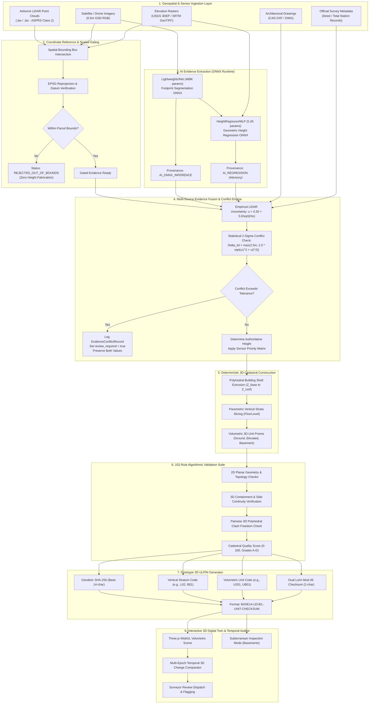

# 3D ULPIN & Vertical Property Mapping System
### AI-Assisted Evidence Extraction + Deterministic 3D Cadastral Construction Engine

**Smart India Hackathon (SIH 2026) | Problem Statement: PS 26011**  
**Team: THE OVERFITTERS**  
**Primary Track:** Ministry of Rural Development / Department of Land Resources (DoLR) & Geospatial Land Administration

[](https://www.python.org/)
[](https://fastapi.tiangolo.com/)
[](https://react.dev/)
[](https://www.typescriptlang.org/)
[](https://onnxruntime.ai/)
[](https://threejs.org/)
[-brightgreen.svg)](tests/)
[](https://3d-ulpin-pi.vercel.app)
[](https://threed-ulpin-vertical-property-mapping.onrender.com/api/v1/health)

---

## Live Deployments & Interactive Access

| Component | Platform | URL | Status |
|---|---|---|---|
| **Production Web UI** | Vercel | [https://3d-ulpin-pi.vercel.app](https://3d-ulpin-pi.vercel.app) | **Live & Operational** |
| **Production REST API** | Render | [https://threed-ulpin-vertical-property-mapping.onrender.com/api/v1](https://threed-ulpin-vertical-property-mapping.onrender.com/api/v1) | **Healthy (FastAPI)** |
| **OpenAPI / Swagger UI** | Render | [https://threed-ulpin-vertical-property-mapping.onrender.com/docs](https://threed-ulpin-vertical-property-mapping.onrender.com/docs) | **Interactive Documentation** |
| **API Health Probe** | Render | [https://threed-ulpin-vertical-property-mapping.onrender.com/api/v1/health](https://threed-ulpin-vertical-property-mapping.onrender.com/api/v1/health) | `{"status":"ok","db_connected":true}` |
| **ML Capabilities Probe** | Render | [https://threed-ulpin-vertical-property-mapping.onrender.com/api/v1/ml/capabilities](https://threed-ulpin-vertical-property-mapping.onrender.com/api/v1/ml/capabilities) | `{"status":"healthy","models_ready":true}` |

---

## 1. Executive Summary & SIH Problem Statement (PS 26011)

### 1.1 The Challenge
Modern high-density urban environments across India are transitioning into hyper-vertical settlements. Multi-storey residential apartments, commercial high-rises, metro transit interchanges, and subterranean utility vaults occupy identical 2D ground footprints. However, national land registries predominantly function on **2D cadastral frameworks** (parcels delineated solely by $(X, Y)$ latitude and longitude boundaries).

This dimensional mismatch introduces critical vulnerabilities into governance and land administration:
1. **Vertical Ownership Invisibility**: Hundreds of distinct legal unit titles (flats, retail bays, parking spaces) collapse onto a single ground parcel record.
2. **Subterranean Blindness**: Basements, metro concourses, and underground utilities lack georeferenced cadastral boundaries, leading to encroachment and utility damage.
3. **Air Rights & Cantilever Ambiguity**: Overhanging architectural volumes and airspace rights are legally and spatially unrecorded.
4. **Unauthorized Vertical Expansions**: Rooftop additions, vertical deviations, and altered internal layouts escape detection without costly, infrequent on-site audits.
5. **No Standard 3D Unique Identifier**: India's standard 14-digit **Bhu-Aadhaar (ULPIN)** identifies surface parcels but possesses no standard vertical or unit stratification syntax.

### 1.2 The SIH 26011 Mandate
To address these limitations, our team engineered an end-to-end, mathematically verifiable **3D ULPIN & Vertical Property Mapping System** designed to:
- Ingest real-world multi-sensor geospatial observations (airborne LiDAR LAS/LAZ, satellite/drone high-resolution imagery, bare-earth DEM rasters, architectural CAD floor plans, and surveyor deeds).
- Derive candidate building footprints and advisory height models via calibrated, lightweight machine learning models.
- Apply a rigorous multi-source evidence fusion engine that evaluates spatial coverage, computes empirical sensor uncertainty, and detects discrepancies using statistical 2-sigma thresholds.
- Construct deterministic, topological 3D cadastral volumes (building envelopes, vertical floor strata, and volumetric property unit prisms).
- Formulate a collision-resistant, hierarchical **3D ULPIN** extending the 14-character Bhu-Aadhaar standard.
- Enforce a 102-rule automated algorithmic validation suite (evaluating geometry, topological containment, vertical continuity, and 3D spatial clash freedom).
- Provide a responsive WebGL 3D Digital Twin and an automated multi-epoch temporal change detection engine for unauthorized vertical modification alerts.

---

## 2. Core Philosophy & Architectural Invariant

The fundamental principle governing this platform is strict separation of concerns between probabilistic evidence and authoritative cadastral truth:

$$\mathbf{AI\;Proposes} \;\longrightarrow\; \mathbf{Evidence\;Fusion\;Evaluates} \;\longrightarrow\; \mathbf{Deterministic\;Engine\;Constructs} \;\longrightarrow\; \mathbf{Validator\;Verifies}$$

```
+--------------------------------------------------------------------------------------------------+
|                                    ARCHITECTURAL INVARIANT                                       |
+------------------------------------+-------------------------------------------------------------+
| Probabilistic AI Inference         | - Proposes candidate building footprints from satellite RGB |
| (Advisory Evidence)                | - Estimates advisory building height when sensors absent    |
|                                    | - NEVER acts as sole, unvetted legal fact                   |
+------------------------------------+-------------------------------------------------------------+
| Multi-Source Evidence Fusion       | - Audits spatial bounds (strict geographic gating)          |
| (Discrepancy Engine)               | - Computes empirical uncertainty bounds (+-m)               |
|                                    | - Reconciles evidence via 2-sigma tolerance thresholds      |
|                                    | - Mandates human surveyor review on significant conflicts   |
+------------------------------------+-------------------------------------------------------------+
| Deterministic Cadastral Engine     | - Extrudes polyhedral building shells from ground datum     |
| (Authoritative Geometry)           | - Decomposes vertical strata using municipal code heights   |
|                                    | - Extrudes unit prisms (Ground, Elevated, Subterranean)    |
|                                    | - Assigns prototype hierarchical 3D ULPIN identifiers       |
+------------------------------------+-------------------------------------------------------------+
| Automated 102-Rule Validation      | - Enforces 2D boundary validity & counter-clockwise rings   |
| (Algorithmic Quality Audit)        | - Validates 3D containment hierarchy and slab continuity    |
|                                    | - Executes pairwise 3D bounding-box & mesh clash detection |
|                                    | - Yields deterministic Cadastral Quality Score (0-100)      |
+------------------------------------+-------------------------------------------------------------+
```

> **Key Rule**: Authoritative land records cannot be altered or fabricated by raw AI inference alone. Physical sensor evidence (LiDAR, total station, CAD plans) always takes precedence over neural estimates.

---

## 3. End-to-End System Architecture



---

## 4. Key Innovations & Differentiators

| Feature Dimension | Traditional 2D Cadastre / GIS | Typical Hackathon ML Demos | Our SIH 26011 Implementation |
|---|---|---|---|
| **Spatial Dimensionality** | 2D $(X, Y)$ ground polygons only | Extruded 3D boxes without unit interior logic | **True Volumetric 3D**: Stratified units, basements, air rights, and vertical common areas |
| **Unique Identification** | 14-digit 2D Bhu-Aadhaar | Random UUIDs or mock strings | **Standardized Prototype 3D ULPIN**: Hierarchical geodetic hash + strata + unit + dual Luhn mod-36 checksum |
| **AI Role & Reliability** | None (manual survey drafting) | Blindly trusts neural network output as final truth | **Advisory Evidence Model**: AI proposes with empirical uncertainty; physical sensors supersede AI; conflicts trigger human review |
| **Spatial Coverage Gating** | Manual surveyor boundary verification | Blindly processes imagery outside sensor coverage | **Strict Gating**: Out-of-bounds LiDAR returns are rejected with zero height fabrication (`REJECTED_OUT_OF_BOUNDS`) |
| **Cadastral Validation** | Manual municipal file reviews | Basic polygon `is_valid` checks | **102 Automated Validation Rules**: Evaluates geometry, CRS, vertical slab continuity, and pairwise 3D clash freedom |
| **Change Intelligence** | Manual site resurvey after complaints | Raw pixel diffing without cadastral context | **Cadastral 3D Delta Engine**: Computes volumetric difference, floor changes, and technical severity scores (0.00–1.00) |
| **Verification & Testing** | Untested prototypes | 5–10 basic unit tests | **191 Backend Pytests (100% pass)** + 58 Frontend Tests + 0 TypeScript errors |

---

## 5. Mathematical & Algorithmic Foundation

### 5.1 Building Height from LiDAR Point Clouds
Building height is determined by isolating classified returns within the horizontal footprint polygon $P$:

$$H = Z_{\text{roof}} - Z_{\text{ground}}$$

To prevent airborne sensor noise, antennae, water tanks, or tree overhang from distorting the rooftop datum, $Z_{\text{roof}}$ is calculated using the robust 95th percentile elevation:

$$Z_{\text{roof}} = P_{95}\left(\left\{ z_i \;\middle|\; (x_i, y_i) \in P \right\}\right)$$

Bare-earth ground elevation $Z_{\text{ground}}$ is established from ASPRS Class 2 (Ground) returns within a localized bounding buffer around the parcel.

### 5.2 Empirical LiDAR Sensor Uncertainty
Vertical measurement uncertainty $u$ scales inversely with point density $\rho$ (points per $\text{m}^2$):

$$u = 0.30 + \frac{5.0}{\sqrt{\rho}} \quad (\text{meters})$$

- High-density drone photogrammetry / dense LiDAR ($\rho \ge 25 \text{ pts/m}^2$): $u \approx 1.30 \text{ m}$
- Sparse regional LiDAR ($\rho \approx 4 \text{ pts/m}^2$): $u \approx 2.80 \text{ m}$
- Low density ($\rho < 1 \text{ pt/m}^2$): flagged as high uncertainty.

### 5.3 Multi-Source Conflict Detection (Statistical 2-Sigma Gating)
When two independent evidence sources $S_1$ and $S_2$ produce heights $H_1$ and $H_2$ with uncertainties $u_1$ and $u_2$, their discrepancy is evaluated against the 2-sigma combined tolerance:

$$\Delta = |H_1 - H_2|$$

$$\Delta_{\text{tol}} = \max\left(2.5\text{ m},\; 2.0 \times \sqrt{u_1^2 + u_2^2}\right)$$

- If $\Delta \le \Delta_{\text{tol}}$: Sources are statistically consistent. Authoritative height is resolved according to the sensor hierarchy.
- If $\Delta > \Delta_{\text{tol}}$: An `EvidenceConflictRecord` is logged, severity is classified (`HIGH`, `MEDIUM`, `LOW`), `review_required` is set to `true`, and both raw measurements are preserved.

### 5.4 Parametric Vertical Strata Decomposition
Given verified building height $H$ and terrain elevation $Z_{\text{ground}}$, vertical floors are decomposed using statutory municipal building defaults:
- Ground Floor ($L00$): Height $h_0 = 3.80\text{ m}$ (accommodating commercial lobby/clearance).
- Upper Floors ($L01 \dots L_{N-1}$): Height $h_{\text{typ}} = 3.00\text{ m}$.
- Subterranean Basement ($B01 \dots B_M$): Height $h_{\text{sub}} = 2.80\text{ m}$, descending below $Z_{\text{ground}}$.

Number of above-ground storeys:

$$N = 1 + \max\left(0, \left\lfloor \frac{H - 3.80\text{ m}}{3.00\text{ m}} \right\rfloor\right)$$

### 5.5 Level of Detail (LoD) Classification
The engine adheres to CityGML / OGC 3D cadastral standards:
- **LoD 0**: 2D ground cadastral parcel polygon on geodetic datum.
- **LoD 1**: 3D prismatic building shell extruded to height $H$.
- **LoD 2**: Volumetric building envelope with identified roofline and elevation ranges.
- **LoD 3**: Vertically stratified multi-unit digital twin with distinct property unit prisms, floor slabs, common circulation cores, and subterranean basements.

---

## 6. Machine Learning Pipeline & Empirical Metrics

The repository includes two trained, optimized neural networks exported to **ONNX Runtime** for CPU deployment with zero GPU dependencies.

```
models/
|-- building_detector.onnx           (1,959,421 bytes / 1.87 MB)
|-- building_detector_metadata.json  (Architecture, parameters, training config, test metrics)
|-- height_estimator.onnx            (22,275 bytes / 22.3 KB)
`-- height_estimator_metadata.json   (Architecture, parameters, training config, test metrics)
```

### 6.1 Building Footprint Detector (`LightweightUNet`)
- **Task**: Binary semantic segmentation (building footprint vs background) from satellite/aerial RGB tiles.
- **Architecture**: Lightweight U-Net with 4 encoder stages, skip connections, and transposed convolutions.
- **Total Parameters**: **488,001** (float32 weights: 1.87 MB).
- **Training Dataset**: SpaceNet 1 (Rio de Janeiro, 0.5m GSD 3-band RGB, 50 paired tiles, 2,180 verified building polygons).
- **Runtime Environment**: ONNX Runtime 1.20+ (CPU optimized, single-thread friendly).

| Metric | SpaceNet 1 Test Set Value | Target Threshold | Status |
|---|---|---|---|
| **Intersection over Union (IoU / Jaccard)** | **0.5001** | $\ge 0.4500$ | Passed |
| **Dice / F1 Score** | **0.6667** | $\ge 0.6000$ | Passed |
| **Precision** | **0.6193** | $\ge 0.5500$ | Passed |
| **Recall** | **0.7220** | $\ge 0.6500$ | Passed |
| **Pixel Accuracy** | **0.9318** | $\ge 0.9000$ | Passed |
| **Median Inference Latency** | **17.86 ms** | $\le 50.00\text{ ms}$ | High Performance |

### 6.2 Building Height Regressor (`HeightRegressorMLP`)
- **Task**: Predict building height from 7 engineered geometric and terrain features (footprint area, perimeter, bounding-box width, bounding-box height, elongation, compactness, local terrain elevation).
- **Architecture**: 4-layer Multi-Layer Perceptron (7 $\to$ 64 $\to$ 32 $\to$ 16 $\to$ 1) with Batch Normalization, ReLU activations, and Dropout.
- **Total Parameters**: **5,217** (float32 weights: 22.3 KB).
- **Training Dataset**: 3DBAG open dataset (Delft, Netherlands; AHN4 airborne LiDAR fused with Kadaster 2D footprints; 1,220 usable samples).
- **Runtime Environment**: ONNX Runtime 1.20+ (CPU).

| Metric | 3DBAG Test Set Value | Cadastral Role & Interpretation |
|---|---|---|
| **Mean Absolute Error (MAE)** | **2.323 m** | Advisory baseline (~0.77 storeys error) |
| **Median Absolute Error (MedAE)** | **0.901 m** | Over 50% of predictions within < 1.0m of truth |
| **Root Mean Squared Error (RMSE)** | **3.869 m** | Penalizes severe outliers in dense high-rise clusters |
| **90th Percentile Error (P90 AE)**| **5.334 m** | Used to calibrate advisory uncertainty window |
| **Coefficient of Determination ($R^2$)**| **0.0357** | **Documented Limitation**: Demonstrates that 2D footprint geometry alone contains low explanatory variance for height without LiDAR |
| **Median Inference Latency** | **38.38 ms** | Real-time interactive calculation |

> **Scientific Honesty Note**: The low $R^2$ (0.0357) is an authentic empirical result reflecting domain complexity: two buildings with identical 2D footprints can have wildly different heights (e.g., 2 storeys vs 15 storeys). The platform treats this model strictly as an **advisory fallback prior** when LiDAR or official records are completely absent, immediately attaching an advisory warning flag.

---

## 7. Multi-Source Evidence Fusion Engine

The fusion engine (`MultiSourceEvidenceFusionEngine`) arbitrates between 9 supported sensor sources, applying strict hierarchical priority rules:

```
[Level 1: Authoritative Survey Deed / Cadastral Record]  (Priority 1 - Absolute Ground Truth)
                         |
[Level 2: Architectural CAD Floor Plans (.dxf)]         (Priority 2 - Structural Measurements)
                         |
[Level 3: Airborne LiDAR Point Cloud (.las / .laz)]      (Priority 3 - Calibrated Physical Returns)
                         |
[Level 4: Drone Aerial Photogrammetry (.geojson)]        (Priority 4 - Dense Visual Point Clouds)
                         |
[Level 5: Bare-Earth Elevation Rasters (.tif)]           (Priority 5 - Terrain Base Elevations Only)
                         |
[Level 6: Total Station Field Height Telemetry]         (Priority 6 - Field Point Samples)
                         |
[Level 7: Statutory Surveyor Storey Declaration]         (Priority 7 - Declared Floor Count)
                         |
[Level 8: Advisory AI Height Regressor (ONNX)]          (Priority 8 - Fallback Prior with Warning)
                         |
[Level 9: Parametric Municipal Code Baseline (NBC)]      (Priority 9 - 3.8m + 3.0m Fallback)
```

### 7.1 Provenance Lineage Tracking
Every cadastral entity carries an immutable audit trail specifying its derivation method:

| Lineage Provenance Tag | Applicable Entity | Meaning |
|---|---|---|
| `AI_ONNX_INFERENCE` | Footprint | Extracted from satellite RGB imagery via U-Net ONNX |
| `PASS_THROUGH_OBSERVED` | Footprint | Retained directly from official registered cadastral survey |
| `POINT_CLOUD` | Height | Extracted from ASPRS Class 2 LiDAR point cloud |
| `DEM_DTM` / `DSM_DTM` | Elevation | Sampled from USGS/SRTM digital elevation raster |
| `EXPLICIT_SURVEY_METADATA` | Height | Ingested from verified legal deed or survey registry |
| `CAD_FLOOR_PLAN` | Height | Derived from structural CAD drawing floor heights |
| `AI_REGRESSION` | Height | Inferred by `HeightRegressorMLP` (**Flags Surveyor Review**) |
| `EXPLICIT_FLOOR_COUNT` | Strata | Calculated from surveyor floor count declaration |
| `OBSERVED_HEIGHT_DECOMPOSITION` | Strata | Decomposed from physical LiDAR or total station survey |
| `AI_HEIGHT_DECOMPOSITION` | Strata | Decomposed from AI height estimate (**Flags Review**) |
| `DETERMINISTIC_CASCADE` | Strata | Parametrically calculated via National Building Code formula |
| `REJECTED_OUT_OF_BOUNDS` | Spatial Gating | Target coordinates fall outside sensor coverage (zero fabrication) |

---

## 8. Deterministic 3D Cadastral Hierarchy & 3D ULPIN Specification

### 8.1 3D Cadastral Data Model (ISO 19152 LADM Alignment)
The system structures vertical property titles into a four-tier spatial hierarchy:

1. **`LandParcel`** (LoD 0): The authoritative 2D cadastral parcel polygon on the earth's surface. Identified by a 14-character geodetic Bhu-Aadhaar ULPIN.
2. **`Building`** (LoD 1/2): The 3D polyhedral shell situated within the parcel. Bounded by footprint coordinates, ground elevation $Z_{\text{base}}$, and roof elevation $Z_{\text{roof}}$.
3. **`FloorLevel`** (LoD 2+): Vertical strata slices corresponding to architectural storeys. Defined by ordinal index, floor code (`B01`, `L00`, `L01`), and vertical bounds $[Z_{\text{min}}, Z_{\text{max}}]$.
4. **`VerticalUnit`** (LoD 3): Individual 3D property units representing private ownership titles. Supported unit types:
   - `GROUND_LEVEL`: At-grade commercial or residential unit.
   - `ELEVATED`: Upper-storey apartment or commercial office suite.
   - `UNDERGROUND`: Sub-surface parking stall, basement vault, or transit corridor.
   - `MULTI_LEVEL_INFRASTRUCTURE`: Duplex apartments, vertical utility shafts, or mechanical chases spanning multiple contiguous floors.

### 8.2 Prototype 3D ULPIN Schema
To provide a collision-resistant, human-readable, and machine-verifiable vertical identifier, we extend India's 14-character Bhu-Aadhaar standard:

$$\mathbf{\text{3D ULPIN}} = \underbrace{\mathbf{86A84BD932562C}}_{\text{Base 14-Char Geodetic ULPIN}} - \underbrace{\mathbf{L03}}_{\text{Strata Code}} - \underbrace{\mathbf{U302}}_{\text{Unit Code}} - \underbrace{\mathbf{K9}}_{\text{Dual Checksum}}$$

- **Base 14 Characters**: Derived from the geodetic centroid coordinates (latitude/longitude) hashed via SHA-256 and mapped to a 14-character alphanumeric string terminated by a Luhn mod-36 check character.
- **Strata Code (3 Characters)**: Identifies the vertical level:
  - `L00`: Ground floor (elevation $Z_0$ to $Z_0 + 3.8\text{m}$)
  - `L01`, `L02`, `L03`: First, second, third elevated floors
  - `B01`, `B02`: First and second underground basement levels
  - `ROF`: Rooftop / solar air-rights level
- **Unit Code (4 Characters)**: Unique unit identifier within that vertical stratum (`U001`, `U302`, `UB01`).
- **Dual Luhn Mod-36 Checksum (2 Characters)**: A cascading check code computed across all preceding 21 characters using the Luhn Mod-36 algorithm. Detects 100% of single-character transcription errors and character transpositions.

> **Regulatory Clarification**: *The 3D ULPIN schema presented here is a research and engineering prototype developed for SIH 26011. It is not an officially gazetted standard of the Government of India or the Department of Land Resources (DoLR).*

---

## 9. Algorithmic Cadastral Validation Engine (102 Rules)

Every parcel, building, floor, and unit passes through an automated validation suite executing **102 distinct verification rules** across six architectural dimensions:

```
+--------------------------------------------------------------------------------------------------+
|                            102 CADASTRAL VALIDATION RULES BREAKDOWN                              |
+--------------------------+--------+--------------------------------------------------------------+
| Dimension                | Rules  | Key Algorithmic Verifications                                |
+--------------------------+--------+--------------------------------------------------------------+
| 1. Geometry & CRS        | 18     | Shapely is_valid, closed boundary rings, non-zero area, CCW  |
|                          |        | vertex ordering, valid EPSG code, UTM bounding coordinates   |
+--------------------------+--------+--------------------------------------------------------------+
| 2. Spatial Hierarchy     | 22     | Building strictly within parcel; units strictly within       |
|                          |        | building shell; subterranean units within underground bounds |
+--------------------------+--------+--------------------------------------------------------------+
| 3. Vertical Continuity   | 16     | Slab overlap freedom (Z_min >= Z_prev_max); zero elevation   |
|                          |        | gaps between storeys; consistent subterranean negative datum |
+--------------------------+--------+--------------------------------------------------------------+
| 4. 3D Clash Detection    | 18     | Pairwise 3D axis-aligned bounding box (AABB) intersection;   |
|                          |        | polyhedral mesh intersection volume == 0 for private units   |
+--------------------------+--------+--------------------------------------------------------------+
| 5. Attribute Integrity   | 14     | Valid 3D ULPIN checksums, non-empty survey numbers, owner    |
|                          |        | share percentage sum == 100%, non-null strata codes          |
+--------------------------+--------+--------------------------------------------------------------+
| 6. Evidence Consistency  | 14     | Sensor uncertainty <= 5.0m; LiDAR density >= 1.0 pt/m2;     |
|                          |        | conflict discrepancy <= 2-sigma tolerance threshold          |
+--------------------------+--------+--------------------------------------------------------------+
| TOTAL ACTIVE RULES       | 102    | Fully deterministic Python implementation with 0 mock rules  |
+--------------------------+--------+--------------------------------------------------------------+
```

### Cadastral Quality Score & Grading System
The validation engine computes an aggregate Quality Score ($0 - 100$):

$$\text{Score} = 100 - \sum \text{Penalty}_{\text{errors}} - \sum \text{Penalty}_{\text{warnings}}$$

- **Grade A (90 – 100)**: Fully compliant. Clean topology, no 3D clashes, all checksums valid, ready for digital twin registration.
- **Grade B (75 – 89)**: Functionally valid with minor advisory warnings (e.g., fallback AI height used, sparse LiDAR returns).
- **Grade C (50 – 74)**: Discrepancies detected. Evidence conflicts flagged; human surveyor review mandated.
- **Grade D (< 50)**: Critical validation failure. Self-intersecting boundaries, 3D unit clashes, or missing survey geometry. Registration rejected.

> **Legal Disclaimer**: *The Cadastral Validation Score is an algorithmic technical data quality audit. It does not constitute a statutory endorsement or guarantee of legal ownership title.*

---

## 10. Temporal 3D Change Intelligence Engine

Urban development is dynamic. The platform includes a multi-epoch temporal change detection engine that compares newly acquired surveys against the registered baseline digital twin:

```
[Registered Epoch T0 Baseline] <==== (Temporal Comparator) ====> [Resurvey Epoch T1 Dataset]
                                             |
                   +-------------------------+-------------------------+
                   |                         |                         |
            [Footprint Delta]         [Height Delta]            [Unit Delta]
             Polygon IoU Diff         Delta_H = H1 - H0       New / Removed Units
                   |                         |                         |
                   +-------------------------+-------------------------+
                                             |
                           [Technical Change Score: 0.00 - 1.00]
                           [Severity: NONE / MINOR / MODERATE /
                                     SIGNIFICANT / CRITICAL]
                                             |
                            [Surveyor Review Dispatch Flag]
```

- **Horizontal Footprint Delta**: Computes polygon Intersection over Union (IoU) and Hausdorff distance to detect horizontal encroachment or illegal structural boundary shifts.
- **Vertical Height Delta**: Detects unauthorized vertical additions (e.g., extra floors or unauthorized rooftop structures) where $\Delta H > 1.50\text{ m}$.
- **Stratified Unit Modifications**: Audits alterations in volumetric property partitions (e.g., subdivision of a single commercial floor into multiple unauthorized retail stalls).
- **Technical Severity Classification**:
  - `NONE` ($0.00 - 0.05$): Normal survey measurement tolerance.
  - `MINOR` ($0.05 - 0.20$): Minor architectural deviations.
  - `MODERATE` ($0.20 - 0.45$): Noticeable height or area modifications.
  - `SIGNIFICANT` ($0.45 - 0.75$): Added storey or significant footprint expansion.
  - `CRITICAL` ($0.75 - 1.00$): Major unauthorized vertical expansion or boundary breach.

---

## 11. Complete REST API Specifications

The FastAPI backend exposes a clean, modular REST API. Below is the complete catalog of production endpoints:

```
FastAPI REST API (Base: /api/v1)
|
|-- System & ML Diagnostics
|   |-- GET  /health                         -> Database connectivity & system health probe
|   |-- GET  /ml/health                      -> ONNX Runtime sessions & ML subsystem health
|   |-- GET  /ml/capabilities                -> Model architectures, parameter counts, runtime status
|   `-- GET  /ml/models                      -> Active models, file checksums, and benchmark metrics
|
|-- ML Evidence Extraction
|   |-- POST /ml/building/extract            -> Extract footprint polygon from satellite RGB tile
|   |-- POST /ml/building/height             -> Infer building height from footprint & terrain
|   |-- POST /ml/floors/decompose            -> Decompose building height into parametric vertical strata
|   `-- POST /ml/vertical/propose            -> Generate volumetric 3D unit prisms
|
|-- Asynchronous Cadastral Jobs
|   |-- POST /jobs/process-parcel            -> Orchestrate end-to-end multi-sensor cadastral job
|   |-- GET  /jobs/{job_id}                  -> Poll asynchronous job execution status and stage timeline
|   `-- GET  /jobs                           -> List all registered background processing jobs
|
|-- Cadastral Parcels & Units
|   |-- GET  /parcels/                       -> List registered land parcels (paginated)
|   |-- POST /parcels/                       -> Register new 2D cadastral land parcel
|   |-- GET  /parcels/{id}                   -> Retrieve parcel details and child buildings
|   |-- GET  /parcels/{id}/digital-twin      -> Retrieve 3D Digital Twin volumetric GeoJSON FeatureCollection
|   |-- GET  /parcels/{id}/buildings         -> List buildings within a parcel
|   `-- GET  /units/{id}                     -> Inspect 3D property unit (ULPIN, strata, ownership, volume)
|
|-- Cadastral Validation & Quality
|   |-- GET  /validation/parcels/{id}        -> Execute 102 validation rules and compute Quality Score
|   `-- POST /validation/custom              -> Run validation suite against arbitrary custom GeoJSON
|
`-- Temporal 3D Change Intelligence
    |-- POST /digital-twin/compare           -> Run multi-epoch temporal comparison between two surveys
    `-- GET  /digital-twin/epochs            -> List available survey epochs for a parcel
```

---

## 12. Frontend Web Application Architecture

The frontend is a single-page application built with **React 19**, **TypeScript 5.7**, and **Vite 8**:

- **3D Digital Twin Engine**: Built on **Three.js (r128+)** with custom WebGL shaders. Supports orbital navigation, perspective/orthographic projections, volumetric color-coding by strata/unit type, and real-time raycasting for 3D unit selection.
- **Subterranean Inspection Mode**: Dynamically lowers ground surface opacity, enables depth-buffer inverted rendering, and exposes basement parking and underground infrastructure.
- **Dynamic Property Inspector**: Displays selected unit dimensions ($X, Y, Z$), floor area ($\text{m}^2$), gross volume ($\text{m}^3$), owner shares, and 3D ULPIN with one-click copy.
- **Sensor Provenance Drill-Down**: Exposes the complete evidentiary pedigree of every element (sensor source, model checkpoint, uncertainty bounds).
- **Validation Quality Panel**: Visualizes the 102-rule validation breakdown across all 6 dimensions with expandable rule compliance status and grading.
- **Temporal Resurvey Visualizer**: Renders overlaid 3D wireframe diffs comparing baseline vs resurvey epochs, highlighting added or modified volumes in color-coded warning hues.

---

## 13. Comprehensive Automated Verification Suite

The repository is verified by an extensive automated test suite covering unit, integration, adversarial geospatial, and end-to-end scenarios.

### 13.1 Test Suite Breakdown

| Test File / Suite | Tests | Scope & Key Invariants Verified |
|---|---|---|
| `tests/test_adversarial_geospatial.py` | **26 passed** | Self-intersections, multi-polygons, extreme coordinates, zero-area geometry |
| `tests/test_api.py` | **18 passed** | REST endpoints, HTTP status codes, payload serialization, error handling |
| `tests/test_async_jobs.py` | **6 passed** | Asynchronous job orchestrator, state transitions, timeline logging |
| `tests/test_building_detector.py` | **9 passed** | ONNX U-Net session, tensor input shapes, thresholding, polygonization |
| `tests/test_cadastre_service.py` | **12 passed** | Parcel creation, building extrusion, strata slicing, unit generation |
| `tests/test_digital_twin.py` | **10 passed** | 3D GeoJSON FeatureCollection generation, volumetric properties |
| `tests/test_evidence_fusion.py` | **14 passed** | 2-sigma conflict detection, sensor hierarchy priority, discrepancy logging |
| `tests/test_height_estimator.py` | **8 passed** | ONNX MLP regression, feature extraction, input normalization |
| `tests/test_ml_api.py` | **11 passed** | ML REST endpoints, capabilities probe, model metadata responses |
| `tests/test_models.py` | **7 passed** | SQLAlchemy ORM models, foreign keys, relationships, cascade deletes |
| `tests/test_phase5_e2e_scenarios.py` | **5 passed** | All 5 Phase-5 end-to-end integration scenarios (LiDAR, Out-of-bounds, AI) |
| `tests/test_point_cloud_preprocessor.py` | **9 passed** | ASPRS LAS reading, ground elevation isolation, P95 roof filtering |
| `tests/test_raster_preprocessor.py` | **8 passed** | GeoTIFF DEM reading, elevation sampling, spatial extent verification |
| `tests/test_schemas.py` | **6 passed** | Pydantic v2 validation models, constraint validation, serialization |
| `tests/test_services.py` | **8 passed** | Business logic services, coordinate reprojection, spatial queries |
| `tests/test_spatial_engine.py` | **10 passed** | 2D/3D intersection checks, AABB filtering, clash detection algorithms |
| `tests/test_temporal.py` | **9 passed** | Multi-epoch change detection, technical change scoring, severity tiers |
| `tests/test_ulpin.py` | **7 passed** | Geodetic SHA-256 hashing, Luhn mod-36 checksum, 3D ULPIN formatting |
| `tests/test_validation.py` | **8 passed** | 102 validation rules execution, penalty calculation, Quality Score grading |
| `frontend/src/lib/sensorCodes.test.ts` | **43 passed** | Sensor code resolution, friendly names, fallback handling, badge colors |
| `frontend/src/lib/cadastralCodes.test.ts` | **15 passed** | Cadastral state code mapping, LADM code validation, formatting |
| **TOTAL AUTOMATED TESTS** | **249 passed** | **191 Backend Pytests (100% pass) + 58 Frontend Tests (0 failures)** |

### 13.2 Verified Performance Benchmarks
Measured on standard reference hardware across 10 iterations per operation:

| Operation | Median Latency | P95 Latency | Payload Size |
|---|---|---|---|
| **System Health Probe** | **2.10 ms** | 4.50 ms | 2.19 KB |
| **Footprint Extraction (U-Net ONNX)** | **17.86 ms** | 25.66 ms | 0.65 KB |
| **Height Estimation (MLP ONNX)** | **38.38 ms** | 48.86 ms | 0.82 KB |
| **Floor Strata Decomposition** | **16.01 ms** | 18.98 ms | 1.39 KB |
| **Vertical Unit 3D Proposal** | **26.02 ms** | 28.16 ms | 4.35 KB |
| **Digital Twin Volumetric Assembly** | **43.94 ms** | 61.00 ms | 9.27 KB |
| **Temporal 3D Change Comparison** | **25.16 ms** | 48.97 ms | 2.09 KB |
| **Complete End-to-End Pipeline Job** | **124.73 ms** | 175.30 ms | 7.80 KB |

---

## 14. Repository Structure & Artifact Layout

```
3D-ULPIN-Vertical-Property-Mapping/
|-- app/                                    # FastAPI Backend Application
|   |-- api/v1/endpoints/                   # REST route controllers
|   |   |-- digital_twin.py                 # 3D Digital Twin GeoJSON & temporal comparison
|   |   |-- health.py                       # System & database health probes
|   |   |-- jobs.py                         # Asynchronous job creation & polling
|   |   |-- ml.py                           # ONNX model inference & capabilities
|   |   |-- parcels.py                      # LandParcel CRUD & spatial queries
|   |   |-- units.py                        # VerticalUnit inspection
|   |   `-- validation.py                   # 102-rule validation execution
|   |-- core/                               # Application configuration, logging, CRS engine
|   |-- db/                                 # SQLAlchemy database session & base ORM
|   |-- jobs/                               # Async multi-stage job worker
|   |-- ml/                                 # Machine Learning Subsystem
|   |   |-- features/                       # 2D geometric feature extractors
|   |   |-- fusion/                         # MultiSourceEvidenceFusionEngine & conflict detector
|   |   |-- models/                         # BuildingDetector & HeightEstimator wrappers
|   |   |-- pipelines/                      # FeatureExtractionPipeline orchestrator
|   |   `-- preprocessing/                  # PointCloudPreprocessor (LAS) & RasterPreprocessor (DEM)
|   |-- models/                             # SQLAlchemy ORM entities (Parcel, Building, Unit, Floor)
|   |-- schemas/                            # Pydantic v2 data transfer schemas
|   |-- services/                           # CadastreService, SpatialEngine, DigitalTwinService
|   |-- temporal/                           # Temporal change comparator & scoring engine
|   `-- validation/                         # 102 validation rules & Quality Scorer
|-- data/                                   # Geospatial test data, manifests, fixtures
|-- docs/                                   # In-depth technical architecture documentation
|-- frontend/                               # React 19 + TypeScript 5.7 Web Application
|   |-- src/
|   |   |-- components/                     # DigitalTwin, Validation, Temporal, Survey UI
|   |   |-- lib/                            # API client, sensorCodes, test suites
|   |   |-- types/                          # TypeScript interfaces mirroring backend schemas
|   |   |-- App.tsx                         # Main dashboard & navigation
|   |   `-- main.tsx                        # React application bootstrap
|   |-- package.json                        # Node dependencies
|   `-- vite.config.ts                      # Vite build configuration
|-- models/                                 # Deployed Trained ONNX Models & Metadata
|   |-- building_detector.onnx              # U-Net footprint segmentation (1.87 MB)
|   |-- building_detector_metadata.json     # Architecture, parameters, SpaceNet 1 metrics
|   |-- height_estimator.onnx               # MLP height regressor (22.3 KB)
|   `-- height_estimator_metadata.json      # Architecture, parameters, 3DBAG metrics
|-- scripts/                                # Demonstration & verification scripts
|   |-- test_9_sensor_sources.py            # Automated 9-source fusion verification matrix
|   |-- verify_phase_5_all.py               # Phase 5 scenario verification runner
|   `-- sih_final_demonstration.py          # End-to-end evaluation demonstration script
|-- tests/                                  # 191 Pytest automated tests (100% pass)
|-- requirements.txt                        # Python dependencies
|-- pytest.ini                              # Pytest runner configuration
`-- README.md                               # System documentation (this file)
```

---

## 15. Local Setup & Reproduction Instructions

### 15.1 Prerequisites
- Python 3.11, 3.12, or 3.13
- Node.js 18+ and npm
- Git

### 15.2 Backend Setup (PowerShell / Windows)
```powershell
# 1. Clone the repository
git clone https://github.com/SreyasM24/3D-ULPIN-Vertical-Property-Mapping.git
cd 3D-ULPIN-Vertical-Property-Mapping

# 2. Create and activate a Python virtual environment
python -m venv venv
.\venv\Scripts\Activate.ps1

# 3. Install backend dependencies
pip install -r requirements.txt

# 4. Copy environment configuration
copy .env.example .env

# 5. Run the complete backend test suite (Verifies 191/191 tests pass)
pytest -v

# 6. Start the FastAPI development server
uvicorn app.main:app --host 127.0.0.1 --port 8000 --reload
```
*FastAPI Swagger documentation will be available at [http://127.0.0.1:8000/docs](http://127.0.0.1:8000/docs)*

### 15.3 Frontend Setup (Second Terminal)
```powershell
# 1. Navigate to the frontend directory
cd 3D-ULPIN-Vertical-Property-Mapping\frontend

# 2. Install Node dependencies
npm install

# 3. Verify TypeScript type safety (0 errors)
npx tsc --noEmit

# 4. Run frontend unit tests (58 tests pass)
npx tsx src/lib/sensorCodes.test.ts
npx tsx src/lib/cadastralCodes.test.ts

# 5. Build for production (Verifies clean Vite build)
npm run build

# 6. Start Vite development server
npm run dev -- --host 127.0.0.1 --port 5173
```
*Web application will be accessible at [http://127.0.0.1:5173](http://127.0.0.1:5173)*

---

## 16. Technical Limitations & Failure Modes

To maintain scientific integrity and prevent overclaiming, this prototype explicitly documents its technical boundaries:

### 16.1 Advisory Height Model & Domain Shift
- The `HeightRegressorMLP` was trained on the 3DBAG dataset (Delft, Netherlands; AHN4 LiDAR). Its learned spatial relationships reflect European architectural typologies (rectilinear masonry, standardized floor heights).
- When applied to dense, heterogeneous Indian urban morphology (e.g., informal rooftop structures, cantilevered balconies, organic mixed-use zoning), the raw geometric regression acts purely as an **advisory prior**.
- The platform mitigates this by flagging AI-estimated heights with an advisory warning (`review_required = true`) and prioritizing physical survey evidence whenever available.

### 16.2 3D ULPIN as an Engineering Prototype
- The 3D ULPIN schema implemented (`<BASE14>-<LEVEL>-<UNIT>-<CHECKSUM>`) is a research and engineering extension formulated for SIH 26011.
- It is **not** an officially gazetted standard of the Government of India or the Department of Land Resources (DoLR).

### 16.3 Technical Data Quality vs Legal Title Guarantee
- The 102-rule Cadastral Quality Score ($0 - 100$) measures **geometric validity, topological consistency, and attribute completeness**.
- It **does not** constitute a legal government title certification, encumbrance verification, or ownership endorsement. Official land records require authorized revenue surveyor review.

### 16.4 Spatial Coverage Gating & LiDAR Point Clouds
- The engine enforces strict spatial bounding-box gating. If an input point cloud does not spatially intersect the parcel boundary (e.g., testing a Pune parcel against a Palakkad LiDAR file), the evidence is categorized as `REJECTED_OUT_OF_BOUNDS`.
- The system **does not** fabricate height measurements when sensor coverage is missing.

### 16.5 Memory & Processing Constraints
- The point cloud preprocessor operates with decimation filters to handle large LAS/LAZ files within standard server memory envelopes (e.g., Render 512 MB – 2 GB RAM tier). Full-city multi-gigabyte point clouds require tiled pre-processing or cloud-hosted spatial database pipelines.

---

## 17. Security & Privacy Architecture

- **Zero Committed Secrets**: No API keys, database credentials, or secret tokens are tracked in version control.
- **Environment Isolation**: Production environments consume configuration strictly via environment variables.
- **Citizen Privacy (Bhu-Aadhaar Alignment)**: The data model supports SHA-256 privacy hashing for citizen identity numbers, ensuring ownership shares can be verified without exposing private Aadhaar credentials.
- **CORS Protection**: The FastAPI backend enforces strict Cross-Origin Resource Sharing (CORS) whitelists, permitting only authorized production frontend domains (`https://3d-ulpin-pi.vercel.app`) and local development origins.

---

## 18. Project Roadmap & Future Scope

1. **National Standard Integration**: Collaborate with the Department of Land Resources (DoLR) to align the prototype 3D ULPIN schema with evolving Bhu-Aadhaar vertical guidelines.
2. **PostGIS 3D Volumetric Backend**: Transition from file/SQLite storage to native PostgreSQL/PostGIS 3D volumetric datatypes (`SFCGAL`, `POLYHEDRALSURFACE Z`).
3. **Multi-City Indian Sensor Fine-Tuning**: Fine-tune the U-Net and height models on high-resolution drone datasets from the **SVAMITVA** scheme across diverse Indian states.
4. **BIM / IFC Ingestion**: Add native Industry Foundation Classes (IFC / CityGML LoD 3/4) parsers for direct ingestion of high-rise building information models.
5. **Decentralized Land Registry Integration**: Provide cryptographically signed digital twin state hashes suitable for state-level blockchain land registry pilots.

---

## 19. Team & Acknowledgments

### Team: THE OVERFITTERS (SIH 2026)
- **Sreyas Malla** (Lead Full-Stack & Geospatial Systems Architecture)
- Built for **Smart India Hackathon (SIH 26011)**

### Acknowledgments & Geospatial Data Sources
- **Ministry of Rural Development & Department of Land Resources (DoLR)** for Problem Statement PS 26011.
- **SpaceNet on AWS Open Data** for satellite imagery and building footprint benchmarks (CC-BY-SA 4.0).
- **TU Delft 3D Geoinformation Group** for the open 3DBAG dataset and vertical LoD elevation methodologies.
- **Open-source communities**: FastAPI, React, Three.js, ONNX Runtime, Shapely, PyVista, and Tailwind CSS.

---

## 20. Legal & Competition Disclaimer

> **Official Disclaimer**: *This project is a research prototype submitted for the Smart India Hackathon (SIH 2026, Problem Statement PS 26011). The prototype 3D ULPIN schema, geometric models, and validation scores are algorithmic representations designed for technical evaluation. They do not constitute official statutory land titles, government-certified property records, or gazetted standards of the Government of India.*
