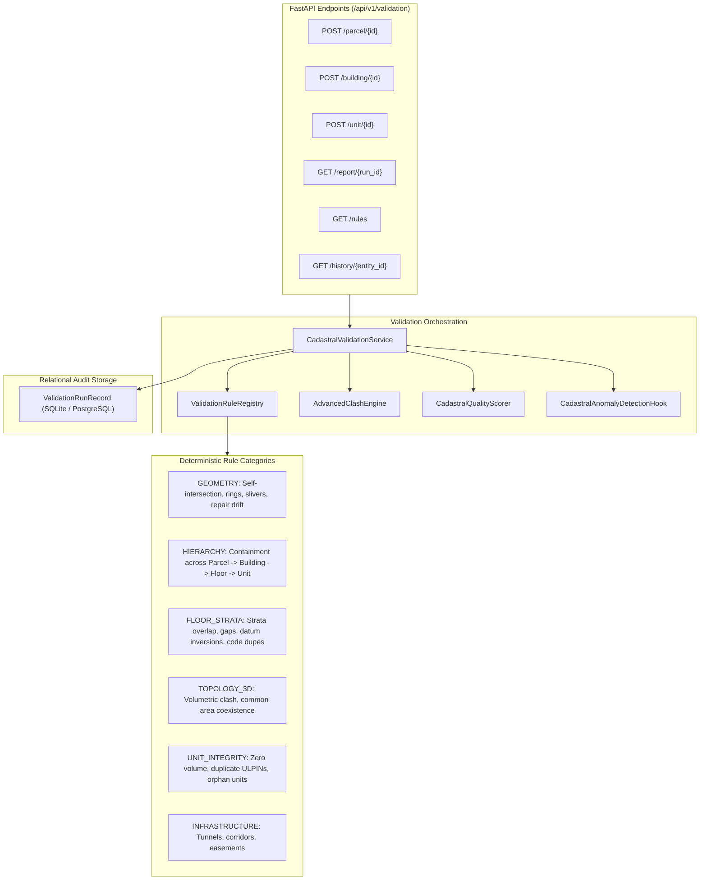

# Advanced Cadastral Topology and Validation Engine

## 1. Executive Summary & SIH 26011 Scope Notice

> [!IMPORTANT]
> **SIH 26011 Prototype Notice**: This validation engine and its derived data-quality scores are technical, algorithmic indicators designed for the Smart India Hackathon prototype evaluation. They **do NOT** convey legal authority, official title confirmation, or Government of India certification.

The **Advanced Cadastral Topology and Validation Engine** elevates the SIH 26011 backend from a geometric calculator into an auditable cadastral-quality validation platform. It evaluates 2D land parcel boundaries, 3D building envelopes, vertical floor strata slices, and 3D property units using deterministic cartographic mathematics (Shapely + PyProj UTM projections).

---

## 2. Architectural Principles

1. **100% Deterministic Mathematical Core**: Authoritative geometric validity and containment are computed using strict computational geometry. No LLMs or machine learning heuristics are used to evaluate geometric correctness.
2. **Context-Aware Spatial Evaluation**: Not every geometric intersection represents an ownership conflict. The engine distinguishes:
   - Actual private property volumetric collisions (`CRITICAL`)
   - Legitimate shared/common space (`INFO`)
   - Underground coexistence vs physical intrusion
   - Boundary tolerance discrepancies (`WARNING`)
   - Unrecorded easement / legal status (`UNKNOWN_REQUIRES_REVIEW`)
3. **No Invented Cadastral Semantics**: Where legal rights or easements are not represented in the input data, the engine flags the condition as `UNKNOWN_REQUIRES_REVIEW` rather than making an unverified legal conclusion.
4. **Transparent, Explainable Quality Scoring**: An audited 0–100 score derived from 6 discrete dimensions with explicit deduction logs.
5. **Auditable History & Reproducibility**: Validation runs are persisted with unique run IDs, timestamps, and input versions, guaranteeing that repeated execution yields identical, deterministic results.

---

## 3. Validation Rule Catalogue

Every rule possesses a stable identifier, category, severity, and deterministic evaluation logic:

| Rule ID | Category | Severity | Title | Affected Entities | Expected Condition |
| :--- | :--- | :--- | :--- | :--- | :--- |
| `RULE-GEO-001` | `GEOMETRY` | `ERROR` | Valid OGC / GeoJSON Polygon Structure | Parcel, Building, Floor, Unit | `is_valid == True` (no self-intersections or bowtie rings) |
| `RULE-GEO-002` | `GEOMETRY` | `ERROR` | Linear Ring Closure & Minimum Coordinates | Parcel, Building, Floor, Unit | Each ring closed ($coord_0 == coord_{-1}$), $\ge 4$ points |
| `RULE-GEO-003` | `GEOMETRY` | `ERROR` | Non-Empty Footprint & Positive Projected Area | Parcel, Building, Floor, Unit | Projected Cartesian UTM area $\ge 0.1\ m^2$ |
| `RULE-GEO-004` | `GEOMETRY` | `WARNING` | Disconnected MultiPolygon Structure Audit | Parcel, Unit | Single contiguous boundary polygon where expected |
| `RULE-GEO-005` | `GEOMETRY` | `WARNING` | Geometry Normalization Drift Audit | Parcel, Building, Unit | Auto-healing area change $\le 1.0\%$ |
| `RULE-HIER-001` | `HIERARCHY` | `ERROR` | Building Footprint Contained in Land Parcel | Building | Building footprint $100\%$ within parcel boundary |
| `RULE-HIER-002` | `HIERARCHY` | `ERROR` | Floor Footprint Contained in Building Envelope | Floor | Floor boundary within building structural envelope |
| `RULE-HIER-003` | `HIERARCHY` | `ERROR` | Unit Footprint Contained in Floor/Building Boundary | Unit | Unit footprint within parent floor/building perimeter |
| `RULE-HIER-004` | `HIERARCHY` | `ERROR` | Unit Vertical Elevation within Building Vertical Range | Unit | Elevation $Z \in [Z_{bottom}^{bld}, Z_{top}^{bld}]$ |
| `RULE-HIER-005` | `HIERARCHY` | `ERROR` | Unit Elevation Conforms to Parent Floor Strata | Unit | Elevation conforms to floor strata (multi-floor duplexes permitted) |
| `RULE-HIER-006` | `HIERARCHY` | `ERROR` | Orphaned Entity Integrity Check | Building, Floor, Unit | Parent foreign key is non-null and refers to active entity |
| `RULE-FLR-001` | `FLOOR_STRATA` | `ERROR` | Non-Overlapping Vertical Floor Strata | Building | Strata vertical overlap $\le tolerance$ ($0.05m$) |
| `RULE-FLR-002` | `FLOOR_STRATA` | `WARNING` | Vertical Strata Gap Audit | Building | Vertical void between consecutive floors $\le 0.5m$ |
| `RULE-FLR-003` | `FLOOR_STRATA` | `ERROR` | Unique Floor Level Codes per Building | Building | Level codes (`L01`, `B01`) unique within building |
| `RULE-FLR-004` | `FLOOR_STRATA` | `ERROR` | Monotonic Floor Level Number Ordering | Building | Level number strictly increases with elevation $Z$ |
| `RULE-FLR-005` | `FLOOR_STRATA` | `ERROR` | Valid Floor Elevation Range & Realistic Height | Floor | $Z_{max} > Z_{min}$; height $h \in [1.5m, 35m]$ |
| `RULE-FLR-006` | `FLOOR_STRATA` | `ERROR` | Basement Strata Datum Consistency | Floor | Basement ceiling $Z_{max} \le Z_{ground} + 0.8m$ plinth tolerance |
| `RULE-FLR-007` | `FLOOR_STRATA` | `ERROR` | Elevated Floor Datum Consistency | Floor | Elevated floor base $Z_{min} \ge Z_{ground} - 0.8m$ plinth tolerance |
| `RULE-TOPO-001` | `TOPOLOGY_3D` | `ERROR` | Private Property Volumetric Intersection | Unit | Private property unit volumes must be disjoint |
| `RULE-TOPO-002` | `TOPOLOGY_3D` | `WARNING` | Near-Boundary Tolerance Discrepancy | Unit | Boundary overlap within tolerance ($0.01 - 0.05m$) |
| `RULE-TOPO-003` | `TOPOLOGY_3D` | `INFO` | Common Area and Service Coexistence | Unit | Permissible shared utility or common circulation space |
| `RULE-UNIT-001` | `UNIT_INTEGRITY` | `ERROR` | Zero or Near-Zero Unit Volume | Unit | Unit enclosed 3D volume $\ge 1.0\ m^3$ |
| `RULE-UNIT-002` | `UNIT_INTEGRITY` | `ERROR` | Unique Unit Identifiers per Building | Building | Unit numbers / codes unique within building |
| `RULE-UNIT-003` | `UNIT_INTEGRITY` | `ERROR` | Unique 3D ULPIN Assignment | Unit | 3D ULPIN globally unique across property units |
| `RULE-INF-001` | `INFRASTRUCTURE` | `WARNING` | Infrastructure Crossing / Unrecorded Easement | Unit | Flags overlap where easement/rights status is unrecorded |

---

## 4. 3D Volumetric Clash & Coexistence Classification

The `AdvancedClashEngine` executes pairwise 3D volumetric collision analysis:
1. **Vertical Elevation Overlap**:
   $$z_{overlap} = \min(z_{max, 1}, z_{max, 2}) - \max(z_{min, 1}, z_{min, 2})$$
   If $z_{overlap} \le tolerance_{z}$ ($0.03m$), entities are vertically separated (no clash possible).
2. **Projected UTM 2D Intersection**:
   Calculates exact metric horizontal intersection area $A_{overlap}\ (m^2)$ in the optimal local UTM CRS.
3. **Volumetric Extrusion**:
   $$V_{overlap} = A_{overlap} \times z_{overlap}\ (m^3)$$
4. **Context-Aware Classification**:
   - `CRITICAL`: Both units are private property (`APARTMENT`, `OFFICE`, `SHOP`, `PARKING`) and $V_{overlap} > 0.005\ m^3$. Represents actual overlapping ownership space.
   - `WARNING`: Minor boundary overlap ($\le 0.05\ m^2$ or $z_{overlap} \le 0.06m$). Represents coordinate precision snapping or shared partition wall thickness.
   - `INFO`: Volumetric intersection between two common elements (`COMMON_AREA`, `UTILITY`, `ELEVATED_STRUCTURE`, `STAIRWELL`). Represents permissible multi-purpose shared space.
   - `UNKNOWN_REQUIRES_REVIEW`: Intersection between private property and infrastructure where legal rights or easements are unrecorded in spatial data.

### Underground and Elevated Infrastructure Coexistence
- **Subterranean Coexistence**: A metro tunnel or utility conduit running beneath a building ($Z_{max}^{tunnel} < Z_{min}^{bld\_basement}$) has $z_{overlap} \le 0$. It is classified as **valid coexistence** (0 clash).
- **Physical Collision**: A tunnel physically penetrating basement parking ($Z_{min}^{bld} < Z_{max}^{tunnel}$) produces a non-zero $V_{overlap}$ and is flagged for cadastral review.

---

## 5. Explainable Cadastral Quality Score

The quality score is a deterministic 0–100 rating derived from 6 explainable dimensions:

$$\text{Total Quality Score} = S_{geo} + S_{crs} + S_{hier} + S_{strata} + S_{topo} + S_{prov}$$

| Dimension | Max Points | Evaluation Criteria & Deductions |
| :--- | :---: | :--- |
| **Geometry Validity** ($S_{geo}$) | 25 | Deducts 12.5 pts per critical geometry error (self-intersections, unclosed rings); 3.0 pts per warning (normalization drift). |
| **CRS & Projection** ($S_{crs}$) | 15 | Deducts 8.0 pts if explicit CRS provenance metadata is missing. |
| **Hierarchical Containment** ($S_{hier}$) | 20 | Deducts 10.0 pts per containment violation (building spills, unit overflows, or orphan links). |
| **Vertical Strata Consistency** ($S_{strata}$) | 15 | Deducts 7.5 pts per strata error (overlapping floors, datum inversions); 2.0 pts per unexplained gap. |
| **3D Topology & Clash Freedom** ($S_{topo}$) | 15 | Deducts 7.5 pts per critical private property clash; 2.0 pts per tolerance warning. |
| **Provenance Completeness** ($S_{prov}$) | 10 | Deducts 4.0 pts for missing ULPIN; 3.0 pts for missing survey number; 3.0 pts for missing spatial capture metadata. |

### Quality Grades (Neutral Technical Labels)
- **`HIGH_CONFIDENCE` (90 – 100)**: Spatial boundaries, strata, and containment meet rigorous technical quality standards.
- **`GOOD_QUALITY` (75 – 89)**: Clean spatial structure with minor non-critical warnings or incomplete metadata.
- **`REQUIRES_REVIEW` (50 – 74)**: Moderate issues such as vertical strata gaps, unrecorded easements, or tolerance overlaps requiring survey review.
- **`INVALID_OR_INCOMPLETE` (0 – 49)**: Critical errors present (self-intersections, building spilling outside parcel, or private property volume collisions).

---

## 6. Audit History & Validation Persistence

Every validation run is persisted in the `validation_run_records` database table:
- `validation_run_id`: UUID identifying the validation batch.
- `target_entity_type` & `target_entity_id`: Entity evaluated (`PARCEL`, `BUILDING`, `UNIT`).
- `engine_version`: Standardized engine identifier (`1.0.0-cadastral-validator`).
- `data_version`: Timestamp or hash of the evaluated data state.
- `is_valid`: Boolean indicating zero critical errors.
- `quality_score` & `quality_grade`: Algorithmic score and grade.
- `rules_executed`, `rules_passed`, `rules_failed`, `critical_issues_count`, `warnings_count`.
- `results`: Complete JSON report payload for immediate frontend retrieval.

---

## 7. Machine Learning Extension Point

Authoritative geometric and topological validation is guaranteed to remain deterministic. For future ML extensions, the engine defines:
- **`CadastralAnomalyDetectionHook`**: Abstract base class defining `detect_anomalies(digital_twin_data)`.
- **`DeterministicDefaultAnomalyHook`**: Production baseline performing statistical outlier checks (e.g., average unit volume plausibility) without external ML or LLM dependencies.
- Future deep learning models (e.g. LiDAR point cloud segmentation anomalies, CAD drawing inconsistency detection) can be attached through this hook without affecting deterministic cadastral rules.

---

## 8. REST API Catalog

| Method | Endpoint | Description |
| :--- | :--- | :--- |
| `GET` | `/api/v1/validation/rules` | Discover all registered validation rules with descriptions and severity |
| `POST` | `/api/v1/validation/parcel/{parcel_id}?persist=true` | Execute comprehensive validation across entire parcel hierarchy |
| `POST` | `/api/v1/validation/building/{building_id}?persist=true` | Validate individual building geometry, containment, and floor strata |
| `POST` | `/api/v1/validation/unit/{unit_id}?persist=true` | Validate individual unit footprint, floor/building containment, and volume |
| `GET` | `/api/v1/validation/report/{validation_run_id}` | Retrieve historical validation audit report by run ID |
| `GET` | `/api/v1/validation/history/{entity_id}?limit=20` | Query chronological validation history and quality score trends |
